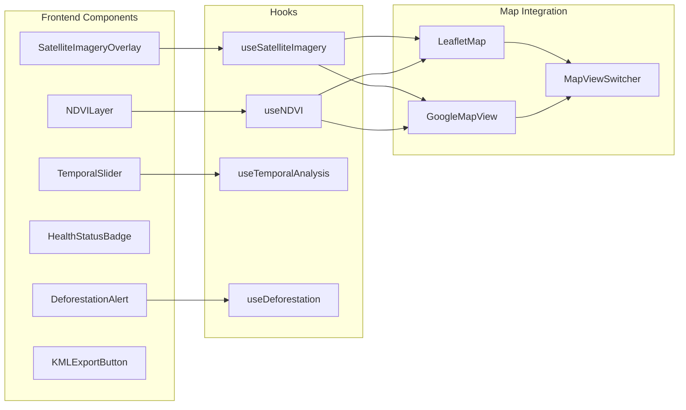
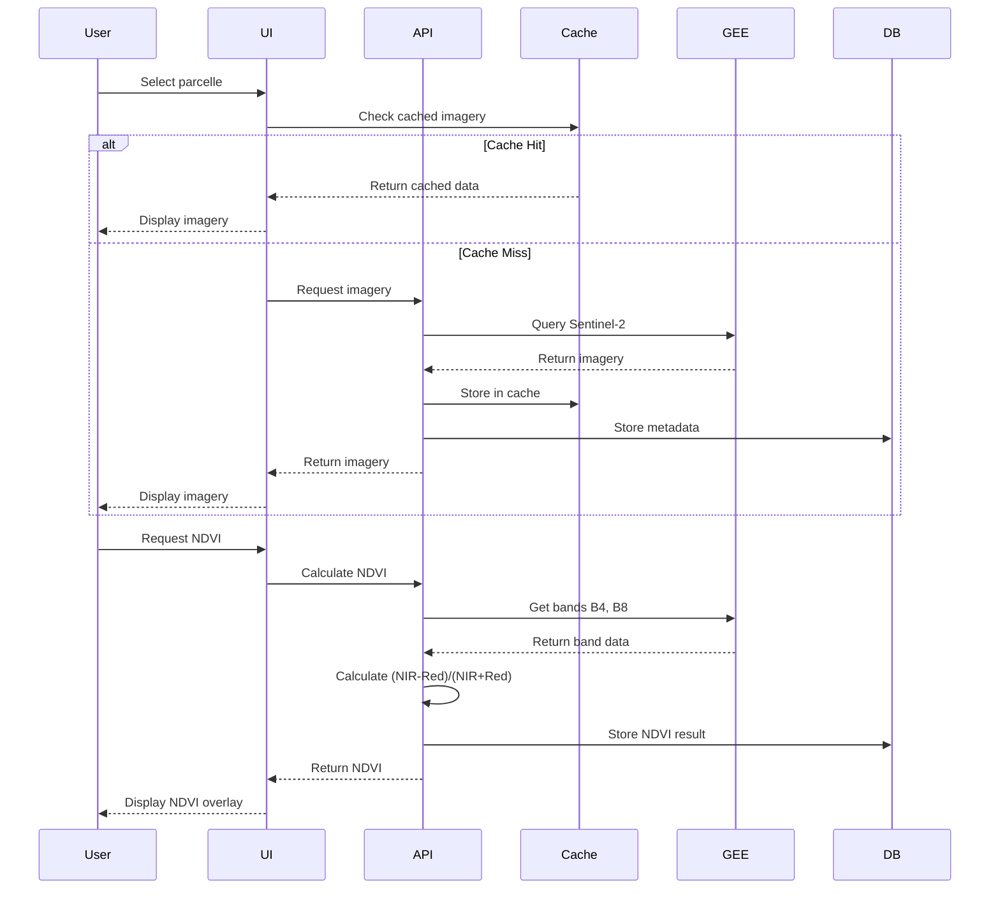
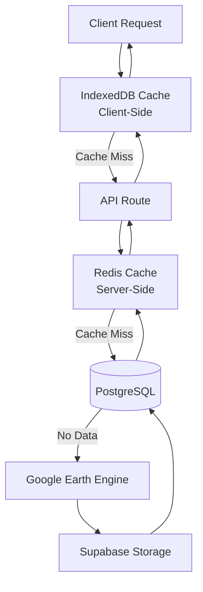

# Design Document: Satellite Imagery Analysis Integration

## Overview

This design document specifies the technical architecture for integrating satellite imagery analysis capabilities into CocoaTrack. The system will leverage Google Earth Engine (GEE) and Sentinel-2 satellite imagery to provide NDVI analysis, deforestation detection, yield prediction, and temporal analysis for cocoa parcelles.

### Business Context

The satellite imagery feature addresses two critical business needs:
1. **EUDR Compliance**: EU Deforestation Regulation 2024 requires proof that cocoa was not grown on deforested land after December 31, 2020
2. **Crop Health Monitoring**: Data-driven insights for agronomists and cooperative managers to optimize interventions and improve yields

### Key Capabilities

- **Satellite Imagery Display**: Overlay Sentinel-2 imagery on parcelle maps with opacity control
- **NDVI Calculation**: Compute and visualize Normalized Difference Vegetation Index for crop health assessment
- **Temporal Analysis**: Track vegetation changes over time with interactive temporal slider
- **Deforestation Detection**: Automated detection of vegetation loss exceeding 0.5 hectares
- **Health Status Classification**: Simple 5-level health status (Excellent, Good, Fair, Poor, Critical)
- **KML Export**: Export parcelle data with NDVI overlays for Google Earth visualization
- **Yield Prediction**: ML-based yield forecasting using NDVI trends and historical data
- **Certification Reports**: Automated EUDR compliance reports with before/after imagery
- **Offline Support**: Cache satellite data for offline access in low-connectivity areas

### Technology Stack Integration

The satellite imagery system integrates with CocoaTrack's existing technology stack:
- **Frontend**: Next.js 14, TypeScript, Tailwind CSS
- **Backend**: Supabase (PostgreSQL + PostGIS), Next.js API Routes
- **Maps**: Leaflet (OSM, Esri Satellite) and Google Maps (hybrid)
- **External APIs**: Google Earth Engine, Sentinel-2 imagery
- **Storage**: Supabase Storage for cached imagery and reports

## Architecture

### High-Level Architecture

```mermaid
graph TB
    subgraph "Client Layer"
        UI[Next.js Frontend]
        MapLeaflet[Leaflet Map]
        MapGoogle[Google Maps]
        TemporalSlider[Temporal Slider]
        NDVIViz[NDVI Visualization]
    end
    
    subgraph "API Layer"
        APIRoutes[Next.js API Routes]
        ImageryAPI[/api/satellite/imagery]
        NDVIAPI[/api/satellite/ndvi]
        DeforestAPI[/api/satellite/deforestation]
        ExportAPI[/api/satellite/export]
    end
    
    subgraph "Service Layer"
        ImageryService[Imagery Service]
        NDVIService[NDVI Service]
        DeforestService[Deforestation Service]
        CacheService[Cache Service]
        ExportService[Export Service]
    end
    
    subgraph "Data Layer"
        Supabase[(Supabase PostgreSQL)]
        SupabaseStorage[Supabase Storage]
        IndexedDB[IndexedDB Cache]
    end
    
    subgraph "External Services"
        GEE[Google Earth Engine]
        Sentinel2[Sentinel-2 Imagery]
    end
    
    UI --> MapLeaflet
    UI --> MapGoogle
    UI --> TemporalSlider
    UI --> NDVIViz
    
    MapLeaflet --> APIRoutes
    MapGoogle --> APIRoutes
    TemporalSlider --> APIRoutes
    NDVIViz --> APIRoutes
    
    APIRoutes --> ImageryAPI
    APIRoutes --> NDVIAPI
    APIRoutes --> DeforestAPI
    APIRoutes --> ExportAPI
    
    ImageryAPI --> ImageryService
    NDVIAPI --> NDVIService
    DeforestAPI --> DeforestService
    ExportAPI --> ExportService
    
    ImageryService --> CacheService
    NDVIService --> CacheService
    DeforestService --> CacheService
    
    ImageryService --> GEE
    GEE --> Sentinel2
    
    CacheService --> Supabase
    CacheService --> SupabaseStorage
    CacheService --> IndexedDB
    
    ExportService --> Supabase
    ExportService --> SupabaseStorage
```

### Component Architecture



### Data Flow Diagram



## Components and Interfaces

### Frontend Components

#### 1. SatelliteImageryOverlay Component

**Purpose**: Display satellite imagery as a map overlay with opacity control

**Props**:
```typescript
interface SatelliteImageryOverlayProps {
  parcelleId: string;
  date?: Date;
  opacity?: number; // 0-1
  onOpacityChange?: (opacity: number) => void;
  onError?: (error: Error) => void;
}
```

**State**:
```typescript
interface SatelliteImageryState {
  imagery: ImageryData | null;
  loading: boolean;
  error: Error | null;
  cloudCover: number;
}
```

**Integration Points**:
- Integrates with LeafletMap via L.TileLayer
- Integrates with GoogleMapView via google.maps.ImageMapType
- Uses useSatelliteImagery hook for data fetching

#### 2. NDVILayer Component

**Purpose**: Visualize NDVI values with color-coded overlay

**Props**:
```typescript
interface NDVILayerProps {
  parcelleId: string;
  date?: Date;
  showLegend?: boolean;
  onNDVICalculated?: (ndvi: NDVIResult) => void;
}
```

**Color Mapping**:
- Red (0.0-0.2): Very poor vegetation
- Yellow (0.2-0.4): Poor vegetation
- Light Green (0.4-0.6): Moderate vegetation
- Green (0.6-0.8): Good vegetation
- Dark Green (0.8-1.0): Excellent vegetation

#### 3. TemporalSlider Component

**Purpose**: Interactive timeline for viewing historical imagery

**Props**:
```typescript
interface TemporalSliderProps {
  parcelleId: string;
  startDate: Date;
  endDate: Date;
  interval: 'daily' | 'weekly' | 'monthly';
  onDateChange: (date: Date) => void;
  highlightChanges?: boolean; // Highlight dates with significant NDVI changes
}
```

**Features**:
- Displays available imagery dates as markers
- Shows cloud cover percentage for each date
- Highlights dates with NDVI change > 0.15
- Supports keyboard navigation (arrow keys)
- Touch-enabled for mobile devices

#### 4. HealthStatusBadge Component

**Purpose**: Display simple health status indicator

**Props**:
```typescript
interface HealthStatusBadgeProps {
  status: HealthStatus;
  showTrend?: boolean;
  trend?: 'improving' | 'stable' | 'declining';
  size?: 'sm' | 'md' | 'lg';
}

type HealthStatus = 'excellent' | 'good' | 'fair' | 'poor' | 'critical';
```

**Color Scheme**:
- Excellent: Dark Green (#2d5016)
- Good: Green (#6FAF3D)
- Fair: Yellow (#fbbf24)
- Poor: Orange (#E68A1F)
- Critical: Red (#ef4444)

#### 5. DeforestationAlert Component

**Purpose**: Display deforestation alerts with before/after comparison

**Props**:
```typescript
interface DeforestationAlertProps {
  alert: DeforestationEvent;
  onAcknowledge?: (alertId: string, notes: string) => void;
  onDispute?: (alertId: string, reason: string) => void;
}
```

#### 6. KMLExportButton Component

**Purpose**: Export parcelle data as KML file

**Props**:
```typescript
interface KMLExportButtonProps {
  parcelleIds: string[];
  includeTemporal?: boolean;
  includeNDVI?: boolean;
  onExportComplete?: (fileUrl: string) => void;
}
```

### Custom Hooks

#### useSatelliteImagery Hook

```typescript
interface UseSatelliteImageryOptions {
  parcelleId: string;
  date?: Date;
  cloudCoverThreshold?: number;
  enableCache?: boolean;
}

interface UseSatelliteImageryReturn {
  imagery: ImageryData | null;
  loading: boolean;
  error: Error | null;
  refetch: () => Promise<void>;
  cloudCover: number;
  acquisitionDate: Date | null;
}

function useSatelliteImagery(
  options: UseSatelliteImageryOptions
): UseSatelliteImageryReturn;
```

#### useNDVI Hook

```typescript
interface UseNDVIOptions {
  parcelleId: string;
  date?: Date;
  autoCalculate?: boolean;
}

interface UseNDVIReturn {
  ndvi: NDVIResult | null;
  loading: boolean;
  error: Error | null;
  calculate: () => Promise<void>;
  healthStatus: HealthStatus;
}

function useNDVI(options: UseNDVIOptions): UseNDVIReturn;
```

#### useTemporalAnalysis Hook

```typescript
interface UseTemporalAnalysisOptions {
  parcelleId: string;
  startDate: Date;
  endDate: Date;
  interval: 'daily' | 'weekly' | 'monthly';
}

interface UseTemporalAnalysisReturn {
  timeline: TemporalDataPoint[];
  loading: boolean;
  error: Error | null;
  selectedDate: Date;
  setSelectedDate: (date: Date) => void;
  ndviChange: number; // Percentage change from baseline
}

function useTemporalAnalysis(
  options: UseTemporalAnalysisOptions
): UseTemporalAnalysisReturn;
```

#### useDeforestation Hook

```typescript
interface UseDeforestationOptions {
  parcelleId: string;
  baselineDate?: Date; // Defaults to Dec 31, 2020
}

interface UseDeforestationReturn {
  alerts: DeforestationEvent[];
  loading: boolean;
  error: Error | null;
  checkForDeforestation: () => Promise<void>;
  acknowledgeAlert: (alertId: string, notes: string) => Promise<void>;
  disputeAlert: (alertId: string, reason: string) => Promise<void>;
}

function useDeforestation(
  options: UseDeforestationOptions
): UseDeforestationReturn;
```

### Backend Services

#### ImageryService

**Purpose**: Interface with Google Earth Engine to retrieve Sentinel-2 imagery

**Methods**:
```typescript
class ImageryService {
  /**
   * Get satellite imagery for a parcelle
   */
  async getImagery(
    geometry: MultiPolygon,
    date: Date,
    cloudCoverThreshold: number
  ): Promise<ImageryData>;
  
  /**
   * Get available imagery dates for a parcelle
   */
  async getAvailableDates(
    geometry: MultiPolygon,
    startDate: Date,
    endDate: Date
  ): Promise<ImageryDate[]>;
  
  /**
   * Get Sentinel-2 bands for NDVI calculation
   */
  async getBands(
    geometry: MultiPolygon,
    date: Date,
    bands: string[]
  ): Promise<BandData>;
}
```

**Implementation Details**:
- Uses Google Earth Engine Python API via Next.js API route
- Implements exponential backoff for rate limiting
- Caches imagery tiles in Supabase Storage
- Filters imagery by cloud cover threshold (default 20%)
- Prioritizes dry season imagery (November-March) for baseline

#### NDVIService

**Purpose**: Calculate and store NDVI values

**Methods**:
```typescript
class NDVIService {
  /**
   * Calculate NDVI for a parcelle
   */
  async calculateNDVI(
    parcelleId: string,
    date: Date
  ): Promise<NDVIResult>;
  
  /**
   * Get cached NDVI result
   */
  async getCachedNDVI(
    parcelleId: string,
    date: Date
  ): Promise<NDVIResult | null>;
  
  /**
   * Calculate health status from NDVI
   */
  calculateHealthStatus(meanNDVI: number): HealthStatus;
  
  /**
   * Get NDVI trend over time
   */
  async getNDVITrend(
    parcelleId: string,
    startDate: Date,
    endDate: Date
  ): Promise<NDVITrend>;
}
```

**NDVI Calculation Formula**:
```
NDVI = (NIR - Red) / (NIR + Red)
```
Where:
- NIR = Sentinel-2 Band 8 (Near-Infrared)
- Red = Sentinel-2 Band 4 (Red)

**Health Status Thresholds**:
- Excellent: 0.7 - 1.0
- Good: 0.6 - 0.7
- Fair: 0.5 - 0.6
- Poor: 0.3 - 0.5
- Critical: 0.0 - 0.3

#### DeforestationService

**Purpose**: Detect and track deforestation events

**Methods**:
```typescript
class DeforestationService {
  /**
   * Detect deforestation by comparing NDVI over time
   */
  async detectDeforestation(
    parcelleId: string,
    baselineDate: Date,
    currentDate: Date
  ): Promise<DeforestationEvent[]>;
  
  /**
   * Get deforestation alerts for a parcelle
   */
  async getAlerts(parcelleId: string): Promise<DeforestationEvent[]>;
  
  /**
   * Acknowledge a deforestation alert
   */
  async acknowledgeAlert(
    alertId: string,
    userId: string,
    notes: string
  ): Promise<void>;
  
  /**
   * Dispute a deforestation alert
   */
  async disputeAlert(
    alertId: string,
    userId: string,
    reason: string
  ): Promise<void>;
}
```

**Detection Algorithm**:
1. Calculate baseline NDVI (December 2020 or closest available)
2. Calculate current NDVI
3. Compute NDVI difference: `ΔND VI = NDVI_baseline - NDVI_current`
4. Flag as deforestation if:
   - ΔNDVI > 0.3 (30% vegetation loss)
   - Affected area > 0.5 hectares
   - Change is persistent (confirmed in subsequent imagery)

#### CacheService

**Purpose**: Manage caching of satellite data

**Methods**:
```typescript
class CacheService {
  /**
   * Store imagery in cache
   */
  async cacheImagery(
    parcelleId: string,
    date: Date,
    imagery: ImageryData
  ): Promise<void>;
  
  /**
   * Get cached imagery
   */
  async getCachedImagery(
    parcelleId: string,
    date: Date
  ): Promise<ImageryData | null>;
  
  /**
   * Store NDVI result in cache
   */
  async cacheNDVI(
    parcelleId: string,
    date: Date,
    ndvi: NDVIResult
  ): Promise<void>;
  
  /**
   * Evict old cache entries (LRU)
   */
  async evictCache(maxEntries: number): Promise<void>;
  
  /**
   * Get cache statistics
   */
  async getCacheStats(): Promise<CacheStats>;
}
```

**Caching Strategy**:
- **Server-side**: Supabase Storage for imagery tiles (90-day retention)
- **Client-side**: IndexedDB for offline access (50 parcelles max, LRU eviction)
- **Database**: PostgreSQL for NDVI results and metadata (indefinite retention)
- **Cache TTL**: 24 hours for imagery, indefinite for NDVI results

#### ExportService

**Purpose**: Generate KML exports and certification reports

**Methods**:
```typescript
class ExportService {
  /**
   * Export parcelle as KML file
   */
  async exportKML(
    parcelleIds: string[],
    options: KMLExportOptions
  ): Promise<string>; // Returns file URL
  
  /**
   * Generate certification report
   */
  async generateCertificationReport(
    parcelleId: string,
    options: ReportOptions
  ): Promise<string>; // Returns PDF URL
  
  /**
   * Export temporal NDVI data as CSV
   */
  async exportTemporalCSV(
    parcelleId: string,
    startDate: Date,
    endDate: Date
  ): Promise<string>; // Returns CSV content
}
```

## Data Models

### Database Schema

#### satellite_imagery Table

Stores metadata about retrieved satellite imagery.

```sql
CREATE TABLE satellite_imagery (
  id UUID PRIMARY KEY DEFAULT uuid_generate_v4(),
  parcelle_id UUID NOT NULL REFERENCES parcelles(id) ON DELETE CASCADE,
  acquisition_date TIMESTAMPTZ NOT NULL,
  cloud_cover_percent DECIMAL(5,2) NOT NULL,
  satellite_source TEXT NOT NULL DEFAULT 'sentinel-2',
  tile_url TEXT NOT NULL, -- Supabase Storage URL
  bounds JSONB NOT NULL, -- GeoJSON bbox
  resolution_meters DECIMAL(6,2) NOT NULL,
  created_at TIMESTAMPTZ NOT NULL DEFAULT NOW(),
  
  CONSTRAINT satellite_imagery_unique UNIQUE (parcelle_id, acquisition_date)
);

CREATE INDEX idx_satellite_imagery_parcelle ON satellite_imagery(parcelle_id);
CREATE INDEX idx_satellite_imagery_date ON satellite_imagery(acquisition_date);
CREATE INDEX idx_satellite_imagery_cloud_cover ON satellite_imagery(cloud_cover_percent);
```

#### ndvi_results Table

Stores calculated NDVI values and statistics.

```sql
CREATE TABLE ndvi_results (
  id UUID PRIMARY KEY DEFAULT uuid_generate_v4(),
  parcelle_id UUID NOT NULL REFERENCES parcelles(id) ON DELETE CASCADE,
  imagery_id UUID REFERENCES satellite_imagery(id) ON DELETE SET NULL,
  calculation_date TIMESTAMPTZ NOT NULL,
  mean_ndvi DECIMAL(5,4) NOT NULL CHECK (mean_ndvi >= -1 AND mean_ndvi <= 1),
  min_ndvi DECIMAL(5,4) NOT NULL CHECK (min_ndvi >= -1 AND min_ndvi <= 1),
  max_ndvi DECIMAL(5,4) NOT NULL CHECK (max_ndvi >= -1 AND max_ndvi <= 1),
  std_dev_ndvi DECIMAL(5,4) NOT NULL,
  health_status TEXT NOT NULL CHECK (health_status IN ('excellent', 'good', 'fair', 'poor', 'critical')),
  ndvi_raster_url TEXT, -- Optional: URL to NDVI raster image
  created_at TIMESTAMPTZ NOT NULL DEFAULT NOW(),
  
  CONSTRAINT ndvi_results_unique UNIQUE (parcelle_id, calculation_date)
);

CREATE INDEX idx_ndvi_results_parcelle ON ndvi_results(parcelle_id);
CREATE INDEX idx_ndvi_results_date ON ndvi_results(calculation_date);
CREATE INDEX idx_ndvi_results_health_status ON ndvi_results(health_status);
CREATE INDEX idx_ndvi_results_mean_ndvi ON ndvi_results(mean_ndvi);
```

#### deforestation_events Table

Stores detected deforestation events and their status.

```sql
CREATE TABLE deforestation_events (
  id UUID PRIMARY KEY DEFAULT uuid_generate_v4(),
  parcelle_id UUID NOT NULL REFERENCES parcelles(id) ON DELETE CASCADE,
  baseline_date TIMESTAMPTZ NOT NULL,
  detection_date TIMESTAMPTZ NOT NULL,
  baseline_ndvi DECIMAL(5,4) NOT NULL,
  current_ndvi DECIMAL(5,4) NOT NULL,
  ndvi_change DECIMAL(5,4) NOT NULL, -- Negative value indicates vegetation loss
  affected_area_hectares DECIMAL(10,4) NOT NULL,
  affected_area_percent DECIMAL(5,2) NOT NULL,
  status TEXT NOT NULL DEFAULT 'pending' CHECK (status IN ('pending', 'acknowledged', 'disputed', 'resolved')),
  acknowledged_by UUID REFERENCES profiles(id),
  acknowledged_at TIMESTAMPTZ,
  acknowledgment_notes TEXT,
  disputed_by UUID REFERENCES profiles(id),
  disputed_at TIMESTAMPTZ,
  dispute_reason TEXT,
  created_at TIMESTAMPTZ NOT NULL DEFAULT NOW(),
  updated_at TIMESTAMPTZ NOT NULL DEFAULT NOW()
);

CREATE INDEX idx_deforestation_events_parcelle ON deforestation_events(parcelle_id);
CREATE INDEX idx_deforestation_events_status ON deforestation_events(status);
CREATE INDEX idx_deforestation_events_detection_date ON deforestation_events(detection_date);
```

#### yield_predictions Table

Stores ML-based yield predictions.

```sql
CREATE TABLE yield_predictions (
  id UUID PRIMARY KEY DEFAULT uuid_generate_v4(),
  parcelle_id UUID NOT NULL REFERENCES parcelles(id) ON DELETE CASCADE,
  prediction_date TIMESTAMPTZ NOT NULL,
  harvest_season TEXT NOT NULL, -- e.g., "2024-Q4"
  predicted_yield_kg_per_ha DECIMAL(10,2) NOT NULL,
  confidence_level TEXT NOT NULL CHECK (confidence_level IN ('high', 'medium', 'low')),
  confidence_interval_lower DECIMAL(10,2) NOT NULL,
  confidence_interval_upper DECIMAL(10,2) NOT NULL,
  model_version TEXT NOT NULL,
  input_features JSONB NOT NULL, -- Stores NDVI trend, historical yield, etc.
  actual_yield_kg_per_ha DECIMAL(10,2), -- Filled after harvest
  created_at TIMESTAMPTZ NOT NULL DEFAULT NOW()
);

CREATE INDEX idx_yield_predictions_parcelle ON yield_predictions(parcelle_id);
CREATE INDEX idx_yield_predictions_season ON yield_predictions(harvest_season);
CREATE INDEX idx_yield_predictions_date ON yield_predictions(prediction_date);
```

#### satellite_cache_metadata Table

Tracks cached satellite data for cache management.

```sql
CREATE TABLE satellite_cache_metadata (
  id UUID PRIMARY KEY DEFAULT uuid_generate_v4(),
  parcelle_id UUID NOT NULL REFERENCES parcelles(id) ON DELETE CASCADE,
  cache_key TEXT NOT NULL UNIQUE,
  data_type TEXT NOT NULL CHECK (data_type IN ('imagery', 'ndvi', 'bands')),
  storage_url TEXT NOT NULL,
  size_bytes BIGINT NOT NULL,
  last_accessed_at TIMESTAMPTZ NOT NULL DEFAULT NOW(),
  expires_at TIMESTAMPTZ NOT NULL,
  created_at TIMESTAMPTZ NOT NULL DEFAULT NOW()
);

CREATE INDEX idx_satellite_cache_parcelle ON satellite_cache_metadata(parcelle_id);
CREATE INDEX idx_satellite_cache_expires ON satellite_cache_metadata(expires_at);
CREATE INDEX idx_satellite_cache_last_accessed ON satellite_cache_metadata(last_accessed_at);
```

### TypeScript Interfaces

#### ImageryData

```typescript
interface ImageryData {
  id: string;
  parcelleId: string;
  acquisitionDate: Date;
  cloudCoverPercent: number;
  satelliteSource: 'sentinel-2';
  tileUrl: string;
  bounds: GeoJSON.BBox;
  resolutionMeters: number;
  createdAt: Date;
}
```

#### NDVIResult

```typescript
interface NDVIResult {
  id: string;
  parcelleId: string;
  imageryId: string | null;
  calculationDate: Date;
  meanNDVI: number; // -1 to 1
  minNDVI: number;
  maxNDVI: number;
  stdDevNDVI: number;
  healthStatus: HealthStatus;
  ndviRasterUrl: string | null;
  createdAt: Date;
}

type HealthStatus = 'excellent' | 'good' | 'fair' | 'poor' | 'critical';
```

#### DeforestationEvent

```typescript
interface DeforestationEvent {
  id: string;
  parcelleId: string;
  baselineDate: Date;
  detectionDate: Date;
  baselineNDVI: number;
  currentNDVI: number;
  ndviChange: number; // Negative value
  affectedAreaHectares: number;
  affectedAreaPercent: number;
  status: 'pending' | 'acknowledged' | 'disputed' | 'resolved';
  acknowledgedBy: string | null;
  acknowledgedAt: Date | null;
  acknowledgmentNotes: string | null;
  disputedBy: string | null;
  disputedAt: Date | null;
  disputeReason: string | null;
  createdAt: Date;
  updatedAt: Date;
}
```

#### TemporalDataPoint

```typescript
interface TemporalDataPoint {
  date: Date;
  ndvi: number;
  cloudCover: number;
  healthStatus: HealthStatus;
  hasSignificantChange: boolean; // NDVI change > 0.15 from previous
}
```

#### YieldPrediction

```typescript
interface YieldPrediction {
  id: string;
  parcelleId: string;
  predictionDate: Date;
  harvestSeason: string;
  predictedYieldKgPerHa: number;
  confidenceLevel: 'high' | 'medium' | 'low';
  confidenceIntervalLower: number;
  confidenceIntervalUpper: number;
  modelVersion: string;
  inputFeatures: {
    meanNDVI: number;
    ndviTrend: number;
    historicalYield: number[];
    surfaceHectares: number;
  };
  actualYieldKgPerHa: number | null;
  createdAt: Date;
}
```

#### KMLExportOptions

```typescript
interface KMLExportOptions {
  includeTemporal: boolean;
  includeNDVI: boolean;
  includeDeforestation: boolean;
  startDate?: Date;
  endDate?: Date;
  format: 'kml' | 'kmz'; // kmz is compressed
}
```

#### ReportOptions

```typescript
interface ReportOptions {
  includeBeforeAfter: boolean;
  includeNDVITrend: boolean;
  includeYieldPrediction: boolean;
  baselineDate: Date;
  language: 'fr' | 'en';
}
```

## Correctness Properties

*A property is a characteristic or behavior that should hold true across all valid executions of a system—essentially, a formal statement about what the system should do. Properties serve as the bridge between human-readable specifications and machine-verifiable correctness guarantees.*

### Property-Based Testing Applicability Assessment

This feature involves significant integration with external services (Google Earth Engine, Sentinel-2), infrastructure configuration, and UI rendering. However, there are core data transformation and business logic components that are suitable for property-based testing:

**Suitable for PBT**:
- NDVI calculation logic (pure function)
- Health status classification (pure function)
- GeoJSON parsing and serialization
- KML generation and formatting
- Deforestation detection algorithm (with mocked imagery data)
- Temporal data aggregation

**NOT suitable for PBT**:
- Google Earth Engine API integration (external service)
- Satellite imagery retrieval (external service, non-deterministic)
- UI rendering and map overlays (visual components)
- Cache management (side effects)
- Report generation (PDF creation)

Given this assessment, we will write correctness properties for the testable components.


### Property Reflection

After analyzing all acceptance criteria, I identified the following redundancies and consolidation opportunities:

**Redundancies Identified**:
1. Properties 2.4 and 2.5 both test statistical calculations on NDVI arrays - can be combined into one comprehensive property
2. Properties 5.2 and 5.3 both test KML content generation - can be combined into one property verifying all required KML elements
3. Properties 6.1 and 6.2 both test health status mapping (NDVI→status and status→color) - can be combined into one comprehensive property
4. Properties 15.1 and 15.3 test parsing and serialization separately, but 15.4 already tests the round-trip which subsumes both
5. Properties 5.6 and 15.6 both test KML specification compliance - can be combined

**Consolidated Properties**:
- Combine 2.4 + 2.5 → "NDVI statistics calculation"
- Combine 5.2 + 5.3 → "KML content completeness"
- Combine 6.1 + 6.2 → "Health status classification and color mapping"
- Remove 15.1 and 15.3 as redundant with 15.4 (round-trip subsumes them)
- Combine 5.6 + 15.6 → "KML specification compliance"

This reduces the property count from 30+ to approximately 25 unique, non-redundant properties.

### Correctness Properties

### Property 1: Cloud Cover Filtering

*For any* collection of satellite imagery records with varying cloud cover percentages, filtering by a cloud cover threshold SHALL return only imagery with cloud cover less than or equal to the threshold.

**Validates: Requirements 1.4**

### Property 2: NDVI Calculation Formula

*For any* valid NIR (Near-Infrared) and Red band values, the calculated NDVI SHALL equal (NIR - Red) / (NIR + Red) and SHALL be in the range [-1, 1].

**Validates: Requirements 2.1**

### Property 3: NDVI Color Mapping

*For any* NDVI value in the range [-1, 1], the assigned color SHALL match the specified gradient ranges: red (0.0-0.2), yellow (0.2-0.4), light green (0.4-0.6), green (0.6-0.8), dark green (0.8-1.0).

**Validates: Requirements 2.3**

### Property 4: NDVI Statistics Calculation

*For any* non-empty array of NDVI pixel values, the calculated statistics (minimum, maximum, mean, standard deviation) SHALL be mathematically correct according to standard statistical formulas.

**Validates: Requirements 2.4, 2.5**

### Property 5: Monthly Interval Calculation

*For any* valid date range (start date and end date), the calculated monthly intervals SHALL include exactly one date per month within the range, with dates falling on the same day of each month (or last day if not available).

**Validates: Requirements 3.3**

### Property 6: NDVI Change Calculation

*For any* two NDVI values (baseline and current), the calculated absolute change SHALL equal (current - baseline) and the percentage change SHALL equal ((current - baseline) / baseline) × 100.

**Validates: Requirements 3.5**

### Property 7: Significant Change Detection

*For any* temporal series of NDVI values, dates with NDVI change greater than 0.15 from the previous measurement SHALL be correctly identified and flagged.

**Validates: Requirements 3.6**

### Property 8: Temporal CSV Serialization

*For any* temporal NDVI dataset containing dates, NDVI values, and change metrics, the generated CSV SHALL include all data points with correct formatting (comma-separated, quoted strings, proper headers).

**Validates: Requirements 3.7**

### Property 9: Deforestation Detection Threshold

*For any* pair of NDVI values (baseline and current) and affected area, a deforestation event SHALL be flagged if and only if (baseline - current) > 0.3 AND affected area > 0.5 hectares.

**Validates: Requirements 4.1, 4.2**

### Property 10: Deforestation Alert Record Completeness

*For any* detected deforestation event, the created alert record SHALL contain all required fields: date, location (parcelle ID), affected area (hectares and percentage), baseline NDVI, current NDVI, and NDVI change.

**Validates: Requirements 4.4**

### Property 11: Deforestation Report Structure

*For any* deforestation event, the generated report SHALL include all required sections: before imagery reference, after imagery reference, NDVI comparison data, and affected area calculation.

**Validates: Requirements 4.6**

### Property 12: Alert Status Transitions

*For any* deforestation alert in 'pending' status, acknowledging the alert SHALL transition it to 'acknowledged' status with acknowledgment metadata, and disputing the alert SHALL transition it to 'disputed' status with dispute metadata.

**Validates: Requirements 4.7**

### Property 13: KML Structure and Content

*For any* parcelle with geometry, NDVI data, and metadata, the generated KML file SHALL include: (1) a valid Polygon element with coordinates, (2) NDVI color coding in the style, (3) all metadata fields (name, surface area, mean NDVI, analysis date, health status) in the description.

**Validates: Requirements 5.1, 5.2, 5.3**

### Property 14: Batch KML Completeness

*For any* collection of parcelles, the batch-generated KML file SHALL contain exactly one Placemark element per parcelle, with each Placemark containing the parcelle's complete data.

**Validates: Requirements 5.5**

### Property 15: KML Specification Compliance

*For any* generated KML file, the XML structure SHALL conform to the KML 2.2 specification, including proper namespace declarations, valid element nesting, and required attributes.

**Validates: Requirements 5.6, 15.6**

### Property 16: Time-Enabled KML Structure

*For any* temporal NDVI dataset, the generated time-enabled KML SHALL include TimeSpan elements for each data point, with begin and end times correctly formatted in ISO 8601 format.

**Validates: Requirements 5.7**

### Property 17: Health Status Classification and Color Mapping

*For any* NDVI value in the range [0, 1], the assigned health status SHALL match the specified ranges (Excellent: 0.7-1.0, Good: 0.6-0.7, Fair: 0.5-0.6, Poor: 0.3-0.5, Critical: 0.0-0.3), and the corresponding color SHALL match the status (dark green, green, yellow, orange, red respectively).

**Validates: Requirements 6.1, 6.2**

### Property 18: Health Status Trend Calculation

*For any* chronological series of health status values over 3 months, the calculated trend SHALL be 'improving' if the most recent status is better than the oldest, 'declining' if worse, and 'stable' if unchanged or fluctuating without clear direction.

**Validates: Requirements 6.5**

### Property 19: Health Status Recommendations

*For any* health status value, the generated recommendation SHALL be appropriate for that status level (e.g., Critical/Poor suggest intervention, Fair suggests monitoring, Good/Excellent suggest maintenance).

**Validates: Requirements 6.6**

### Property 20: Health Status Distribution Aggregation

*For any* collection of parcelles with health statuses, the calculated distribution SHALL correctly count the number of parcelles in each status category, with the sum equaling the total number of parcelles.

**Validates: Requirements 6.7**

### Property 21: GeoJSON Round-Trip Preservation

*For any* valid Parcelle_Geometry object, parsing to GeoJSON then serializing back to Parcelle_Geometry SHALL produce an equivalent object with identical coordinates and geometry type.

**Validates: Requirements 15.4**

### Property 22: NDVI Band Data Parsing

*For any* valid Sentinel-2 band data (B4 Red and B8 NIR), the parsed NDVI_Result object SHALL contain correctly structured band values, calculated NDVI, and validation status.

**Validates: Requirements 15.5**

### Property 23: KML Round-Trip Essential Fields

*For any* valid NDVI_Result object, serializing to KML then parsing the KML SHALL preserve all essential data fields: geometry coordinates, NDVI values (mean, min, max), and metadata (parcelle name, surface area, health status).

**Validates: Requirements 15.7**

## Error Handling

### Error Categories

#### 1. External Service Errors

**Google Earth Engine API Errors**:
- **Rate Limit Exceeded**: Implement exponential backoff (1s, 2s, 4s, 8s, max 3 retries)
- **Authentication Failure**: Log error, notify admin, return 503 Service Unavailable
- **Timeout**: Retry once after 5 seconds, then return cached data if available
- **Invalid Request**: Log error with request details, return 400 Bad Request with user-friendly message

**Sentinel-2 Data Unavailable**:
- **No Imagery Available**: Return error with date range of available imagery
- **Cloud Cover Too High**: Return warning with cloud cover percentage, suggest alternative dates
- **Geometry Too Large**: Return error suggesting geometry simplification or splitting

#### 2. Data Validation Errors

**Invalid Geometry**:
- Validate GeoJSON structure before sending to GEE
- Return 400 Bad Request with specific validation error (e.g., "Invalid coordinate format")
- Suggest corrections when possible

**Invalid Date Range**:
- Validate start date < end date
- Validate dates are not in the future
- Return 400 Bad Request with clear error message

**Invalid NDVI Values**:
- Validate NDVI is in range [-1, 1]
- Log warning if NDVI is outside expected range for vegetation (0.2-0.9)
- Flag suspicious values for manual review

#### 3. Cache Errors

**Cache Miss**:
- Gracefully fall back to API request
- Log cache miss for monitoring
- Update cache after successful API request

**Cache Corruption**:
- Detect corrupted cache entries via checksum validation
- Evict corrupted entries
- Log error for investigation
- Fall back to API request

**Storage Full**:
- Implement LRU eviction when storage limit reached
- Log warning when storage usage exceeds 80%
- Notify admin when storage usage exceeds 90%

#### 4. Calculation Errors

**Division by Zero in NDVI**:
- Handle case where NIR + Red = 0
- Return NDVI = 0 with warning flag
- Log occurrence for investigation

**Insufficient Data Points**:
- Require minimum 10 pixels for NDVI calculation
- Return error if insufficient data
- Suggest larger parcelle or higher resolution imagery

**Statistical Calculation Errors**:
- Validate input arrays are non-empty
- Handle edge cases (single value, all identical values)
- Return appropriate error messages

### Error Response Format

All API errors follow a consistent format:

```typescript
interface ErrorResponse {
  error: {
    code: string; // Machine-readable error code
    message: string; // User-friendly error message
    details?: Record<string, unknown>; // Additional error context
    retryable: boolean; // Whether the request can be retried
    suggestedAction?: string; // Suggested user action
  };
}
```

**Example Error Responses**:

```json
{
  "error": {
    "code": "IMAGERY_UNAVAILABLE",
    "message": "Aucune imagerie satellite disponible pour cette date",
    "details": {
      "requestedDate": "2024-01-15",
      "availableDateRange": {
        "start": "2024-01-01",
        "end": "2024-01-10"
      }
    },
    "retryable": false,
    "suggestedAction": "Sélectionnez une date entre le 1er et le 10 janvier 2024"
  }
}
```

```json
{
  "error": {
    "code": "RATE_LIMIT_EXCEEDED",
    "message": "Limite d'utilisation de l'API atteinte. Veuillez réessayer dans quelques minutes.",
    "details": {
      "retryAfter": 120,
      "dailyLimit": 250000,
      "currentUsage": 250000
    },
    "retryable": true,
    "suggestedAction": "Attendez 2 minutes avant de réessayer"
  }
}
```

### Logging Strategy

**Log Levels**:
- **ERROR**: API failures, calculation errors, data corruption
- **WARN**: High cloud cover, cache misses, approaching rate limits
- **INFO**: Successful API requests, cache hits, deforestation detections
- **DEBUG**: Detailed request/response data, calculation steps

**Log Structure**:
```typescript
interface LogEntry {
  timestamp: string;
  level: 'ERROR' | 'WARN' | 'INFO' | 'DEBUG';
  service: string; // e.g., 'ImageryService', 'NDVIService'
  operation: string; // e.g., 'getImagery', 'calculateNDVI'
  userId?: string;
  parcelleId?: string;
  duration?: number; // milliseconds
  error?: {
    code: string;
    message: string;
    stack?: string;
  };
  metadata?: Record<string, unknown>;
}
```

**Monitoring Alerts**:
- Alert when error rate exceeds 5% over 5-minute window
- Alert when API usage exceeds 80% of daily limit
- Alert when cache hit rate drops below 50%
- Alert when average response time exceeds 5 seconds

## Testing Strategy

### Testing Approach

The satellite imagery feature requires a dual testing approach combining property-based testing for core logic with integration testing for external services and UI components.

### Property-Based Testing

**Framework**: fast-check (TypeScript property-based testing library)

**Configuration**:
- Minimum 100 iterations per property test
- Seed-based reproducibility for failed tests
- Shrinking enabled to find minimal failing examples

**Test Organization**:
```
tests/
  satellite/
    properties/
      ndvi.properties.test.ts
      deforestation.properties.test.ts
      kml.properties.test.ts
      geojson.properties.test.ts
      health-status.properties.test.ts
      temporal.properties.test.ts
```

**Property Test Example**:
```typescript
import fc from 'fast-check';
import { calculateNDVI } from '@/lib/satellite/ndvi';

describe('Property 2: NDVI Calculation Formula', () => {
  it('should calculate NDVI correctly for any valid NIR and Red values', () => {
    // Feature: satellite-imagery-analysis, Property 2: NDVI Calculation Formula
    fc.assert(
      fc.property(
        fc.float({ min: 0, max: 10000 }), // NIR band value
        fc.float({ min: 0, max: 10000 }), // Red band value
        (nir, red) => {
          const ndvi = calculateNDVI(nir, red);
          const expected = (nir - red) / (nir + red);
          
          // NDVI should match formula
          expect(ndvi).toBeCloseTo(expected, 6);
          
          // NDVI should be in valid range
          expect(ndvi).toBeGreaterThanOrEqual(-1);
          expect(ndvi).toBeLessThanOrEqual(1);
        }
      ),
      { numRuns: 100 }
    );
  });
});
```

### Unit Testing

**Framework**: Jest + React Testing Library

**Coverage Requirements**:
- Minimum 80% code coverage for service layer
- Minimum 70% code coverage for UI components
- 100% coverage for critical paths (NDVI calculation, deforestation detection)

**Unit Test Categories**:

1. **Service Layer Tests**:
   - ImageryService: Mock GEE API responses
   - NDVIService: Test calculation logic with known inputs
   - DeforestationService: Test detection algorithm with synthetic data
   - CacheService: Test cache hit/miss logic
   - ExportService: Test KML/CSV generation

2. **Component Tests**:
   - SatelliteImageryOverlay: Test opacity control, error states
   - NDVILayer: Test color mapping, legend display
   - TemporalSlider: Test date selection, keyboard navigation
   - HealthStatusBadge: Test status display, trend indicators
   - DeforestationAlert: Test alert display, acknowledgment flow

3. **Hook Tests**:
   - useSatelliteImagery: Test loading states, error handling, caching
   - useNDVI: Test calculation trigger, result caching
   - useTemporalAnalysis: Test date range handling, change detection
   - useDeforestation: Test alert fetching, status updates

### Integration Testing

**Framework**: Playwright for E2E tests

**Test Scenarios**:

1. **Map Integration**:
   - Verify satellite overlay displays on Leaflet map
   - Verify satellite overlay displays on Google Maps
   - Verify opacity control affects both map types
   - Verify map switching preserves overlay state

2. **API Integration**:
   - Mock Google Earth Engine API responses
   - Test rate limiting and retry logic
   - Test cache behavior with real Supabase instance
   - Test error handling for API failures

3. **Database Integration**:
   - Test NDVI result storage and retrieval
   - Test deforestation alert CRUD operations
   - Test cache metadata management
   - Test data consistency across tables

4. **End-to-End Workflows**:
   - User selects parcelle → imagery loads → NDVI calculated → health status displayed
   - User moves temporal slider → imagery updates → NDVI recalculated
   - Deforestation detected → alert created → notification sent → user acknowledges
   - User exports KML → file generated → downloads successfully

### Performance Testing

**Tools**: k6 for load testing, Lighthouse for frontend performance

**Performance Targets**:
- Imagery loading: < 3 seconds (p50), < 5 seconds (p95)
- NDVI calculation: < 2 seconds (p50), < 4 seconds (p95)
- KML export: < 5 seconds for single parcelle, < 30 seconds for 10 parcelles
- API throughput: 50 concurrent users without degradation

**Load Testing Scenarios**:
1. Sustained load: 50 concurrent users for 10 minutes
2. Spike test: Ramp from 10 to 100 users in 1 minute
3. Stress test: Gradually increase load until system breaks
4. Soak test: 20 concurrent users for 2 hours (cache behavior)

### Validation Testing

**Field Validation**:
- Compare NDVI calculations against ground truth measurements (±5% accuracy target)
- Validate deforestation detection against manual imagery review (95% accuracy target)
- Validate yield predictions against actual harvest data (±15% accuracy target)

**User Acceptance Testing**:
- Cooperative managers test satellite imagery display
- Agronomists test NDVI analysis and recommendations
- Certification auditors test EUDR compliance reports
- Planteurs test mobile responsiveness and offline mode

### Test Data Strategy

**Synthetic Data Generation**:
- Generate random parcelle geometries using Turf.js
- Generate synthetic NDVI values with realistic distributions
- Generate temporal series with seasonal patterns
- Generate deforestation scenarios with varying severity

**Test Fixtures**:
- Sample Sentinel-2 imagery tiles (small regions)
- Pre-calculated NDVI results for known geometries
- Sample KML files for validation
- Mock GEE API responses

**Test Database**:
- Separate Supabase project for testing
- Seed with representative parcelle data
- Reset between test runs
- Isolated from production data

### Continuous Integration

**CI Pipeline** (GitHub Actions):
1. Lint and type check
2. Run unit tests with coverage report
3. Run property-based tests (100 iterations)
4. Run integration tests against test database
5. Run E2E tests with Playwright
6. Generate and upload coverage reports
7. Performance regression tests (compare against baseline)

**Pre-deployment Checks**:
- All tests passing
- Code coverage > 80%
- No critical security vulnerabilities (npm audit)
- Performance metrics within acceptable range
- Manual QA sign-off for major features


## API Design

### REST API Endpoints

#### 1. GET /api/satellite/imagery

Get satellite imagery for a parcelle.

**Request**:
```typescript
interface GetImageryRequest {
  parcelleId: string;
  date?: string; // ISO 8601 date, defaults to most recent
  cloudCoverThreshold?: number; // 0-100, defaults to 20
}
```

**Response**:
```typescript
interface GetImageryResponse {
  imagery: ImageryData;
  cached: boolean;
  cacheAge?: number; // seconds
}
```

**Error Codes**:
- `PARCELLE_NOT_FOUND`: Parcelle ID does not exist
- `IMAGERY_UNAVAILABLE`: No imagery available for date/geometry
- `RATE_LIMIT_EXCEEDED`: GEE API rate limit reached
- `INVALID_GEOMETRY`: Parcelle geometry is invalid

#### 2. POST /api/satellite/ndvi

Calculate NDVI for a parcelle.

**Request**:
```typescript
interface CalculateNDVIRequest {
  parcelleId: string;
  date?: string; // ISO 8601 date, defaults to most recent
  forceRecalculate?: boolean; // Bypass cache
}
```

**Response**:
```typescript
interface CalculateNDVIResponse {
  ndvi: NDVIResult;
  cached: boolean;
}
```

**Error Codes**:
- `PARCELLE_NOT_FOUND`: Parcelle ID does not exist
- `INSUFFICIENT_DATA`: Not enough pixels for calculation
- `CALCULATION_ERROR`: NDVI calculation failed

#### 3. GET /api/satellite/temporal

Get temporal NDVI data for a parcelle.

**Request**:
```typescript
interface GetTemporalRequest {
  parcelleId: string;
  startDate: string; // ISO 8601
  endDate: string; // ISO 8601
  interval: 'daily' | 'weekly' | 'monthly';
}
```

**Response**:
```typescript
interface GetTemporalResponse {
  timeline: TemporalDataPoint[];
  summary: {
    totalDataPoints: number;
    significantChanges: number;
    overallTrend: 'improving' | 'stable' | 'declining';
  };
}
```

#### 4. GET /api/satellite/deforestation

Get deforestation alerts for a parcelle.

**Request**:
```typescript
interface GetDeforestationRequest {
  parcelleId: string;
  status?: 'pending' | 'acknowledged' | 'disputed' | 'resolved';
}
```

**Response**:
```typescript
interface GetDeforestationResponse {
  alerts: DeforestationEvent[];
  summary: {
    totalAlerts: number;
    pendingAlerts: number;
    affectedAreaTotal: number; // hectares
  };
}
```

#### 5. POST /api/satellite/deforestation/check

Trigger deforestation detection for a parcelle.

**Request**:
```typescript
interface CheckDeforestationRequest {
  parcelleId: string;
  baselineDate?: string; // ISO 8601, defaults to Dec 31, 2020
  currentDate?: string; // ISO 8601, defaults to most recent
}
```

**Response**:
```typescript
interface CheckDeforestationResponse {
  newAlerts: DeforestationEvent[];
  checked: boolean;
}
```

#### 6. PATCH /api/satellite/deforestation/:alertId

Acknowledge or dispute a deforestation alert.

**Request**:
```typescript
interface UpdateAlertRequest {
  action: 'acknowledge' | 'dispute';
  notes?: string;
  reason?: string; // Required for dispute
}
```

**Response**:
```typescript
interface UpdateAlertResponse {
  alert: DeforestationEvent;
  updated: boolean;
}
```

#### 7. POST /api/satellite/export/kml

Export parcelle data as KML.

**Request**:
```typescript
interface ExportKMLRequest {
  parcelleIds: string[];
  options: KMLExportOptions;
}
```

**Response**:
```typescript
interface ExportKMLResponse {
  fileUrl: string; // Supabase Storage URL
  fileName: string;
  fileSize: number; // bytes
  expiresAt: string; // ISO 8601
}
```

#### 8. POST /api/satellite/export/csv

Export temporal NDVI data as CSV.

**Request**:
```typescript
interface ExportCSVRequest {
  parcelleId: string;
  startDate: string;
  endDate: string;
}
```

**Response**:
```typescript
interface ExportCSVResponse {
  csvContent: string;
  fileName: string;
}
```

#### 9. POST /api/satellite/reports/certification

Generate EUDR certification report.

**Request**:
```typescript
interface GenerateCertificationReportRequest {
  parcelleId: string;
  options: ReportOptions;
}
```

**Response**:
```typescript
interface GenerateCertificationReportResponse {
  reportUrl: string; // PDF URL in Supabase Storage
  reportId: string;
  generatedAt: string;
  expiresAt: string;
}
```

#### 10. GET /api/satellite/health-status/:parcelleId

Get current health status for a parcelle.

**Request**: None (parcelleId in URL)

**Response**:
```typescript
interface GetHealthStatusResponse {
  parcelleId: string;
  healthStatus: HealthStatus;
  meanNDVI: number;
  lastCalculated: string; // ISO 8601
  trend: 'improving' | 'stable' | 'declining';
  recommendation: string;
}
```

### Rate Limiting Strategy

**Rate Limits**:
- Authenticated users: 100 requests per minute per user
- Admin users: 500 requests per minute
- Global limit: 1000 requests per minute across all users

**Rate Limit Headers**:
```
X-RateLimit-Limit: 100
X-RateLimit-Remaining: 95
X-RateLimit-Reset: 1640000000
```

**Rate Limit Exceeded Response**:
```json
{
  "error": {
    "code": "RATE_LIMIT_EXCEEDED",
    "message": "Trop de requêtes. Veuillez réessayer dans 60 secondes.",
    "retryAfter": 60
  }
}
```

### API Authentication

All satellite API endpoints require authentication via Supabase JWT token.

**Authorization Header**:
```
Authorization: Bearer <supabase_jwt_token>
```

**Role-Based Access**:
- **Planteur**: Can access own parcelles only
- **Cooperative Manager**: Can access all parcelles in cooperative
- **Agronomist**: Can access assigned parcelles
- **Certification Auditor**: Read-only access to all parcelles
- **Admin**: Full access to all endpoints

## Caching Strategy

### Multi-Layer Caching Architecture



### Client-Side Caching (IndexedDB)

**Purpose**: Enable offline access and reduce network requests

**Storage Schema**:
```typescript
interface CachedImagery {
  id: string;
  parcelleId: string;
  date: string;
  imagery: Blob; // Image tile
  metadata: ImageryData;
  cachedAt: number; // timestamp
}

interface CachedNDVI {
  id: string;
  parcelleId: string;
  date: string;
  ndvi: NDVIResult;
  cachedAt: number;
}
```

**Cache Policy**:
- Maximum 50 parcelles cached per user
- LRU eviction when limit reached
- Favorite parcelles never evicted
- Cache invalidation after 30 days
- Manual refresh option available

**Implementation**:
```typescript
class IndexedDBCache {
  private db: IDBDatabase;
  
  async cacheImagery(parcelleId: string, date: Date, imagery: Blob): Promise<void>;
  async getCachedImagery(parcelleId: string, date: Date): Promise<Blob | null>;
  async cacheNDVI(parcelleId: string, date: Date, ndvi: NDVIResult): Promise<void>;
  async getCachedNDVI(parcelleId: string, date: Date): Promise<NDVIResult | null>;
  async evictLRU(): Promise<void>;
  async clearCache(): Promise<void>;
}
```

### Server-Side Caching (Redis)

**Purpose**: Reduce database queries and GEE API calls

**Cache Keys**:
```
imagery:{parcelleId}:{date}
ndvi:{parcelleId}:{date}
temporal:{parcelleId}:{startDate}:{endDate}:{interval}
deforestation:{parcelleId}
health-status:{parcelleId}
```

**TTL Configuration**:
- Imagery metadata: 24 hours
- NDVI results: 7 days (recalculated weekly)
- Temporal data: 24 hours
- Deforestation alerts: 1 hour (frequently updated)
- Health status: 24 hours

**Cache Invalidation**:
- Invalidate on new NDVI calculation
- Invalidate on deforestation alert acknowledgment
- Invalidate on parcelle geometry update
- Manual invalidation via admin API

### Database Caching (PostgreSQL)

**Purpose**: Persistent storage of calculated results

**Cached Data**:
- NDVI results (indefinite retention)
- Deforestation events (7-year retention for EUDR)
- Yield predictions (indefinite retention)
- Satellite imagery metadata (90-day retention)

**Indexes for Performance**:
```sql
CREATE INDEX idx_ndvi_results_parcelle_date ON ndvi_results(parcelle_id, calculation_date DESC);
CREATE INDEX idx_satellite_imagery_parcelle_date ON satellite_imagery(parcelle_id, acquisition_date DESC);
CREATE INDEX idx_deforestation_events_parcelle_status ON deforestation_events(parcelle_id, status);
```

### Storage Caching (Supabase Storage)

**Purpose**: Store imagery tiles and generated files

**Storage Buckets**:
- `satellite-imagery`: Raw imagery tiles (90-day retention)
- `ndvi-rasters`: NDVI visualization rasters (30-day retention)
- `kml-exports`: Generated KML files (7-day retention)
- `certification-reports`: PDF reports (1-year retention)

**Storage Policy**:
```typescript
interface StoragePolicy {
  bucket: string;
  maxSize: number; // bytes
  allowedMimeTypes: string[];
  retention: number; // days
  publicAccess: boolean;
}

const STORAGE_POLICIES: Record<string, StoragePolicy> = {
  'satellite-imagery': {
    bucket: 'satellite-imagery',
    maxSize: 10 * 1024 * 1024, // 10 MB
    allowedMimeTypes: ['image/png', 'image/jpeg', 'image/tiff'],
    retention: 90,
    publicAccess: false,
  },
  'kml-exports': {
    bucket: 'kml-exports',
    maxSize: 5 * 1024 * 1024, // 5 MB
    allowedMimeTypes: ['application/vnd.google-earth.kml+xml', 'application/vnd.google-earth.kmz'],
    retention: 7,
    publicAccess: false,
  },
  // ... other buckets
};
```

### Cache Warming Strategy

**Proactive Caching**:
- Pre-cache imagery for favorite parcelles
- Pre-calculate NDVI for recently viewed parcelles
- Pre-generate temporal data for cooperative manager dashboard
- Background job to refresh stale cache entries

**Cache Warming Schedule**:
```typescript
// Run daily at 2 AM
async function warmCache() {
  // 1. Get favorite parcelles for all users
  const favorites = await getFavoriteParcelles();
  
  // 2. Pre-cache most recent imagery
  for (const parcelle of favorites) {
    await cacheImagery(parcelle.id, new Date());
  }
  
  // 3. Pre-calculate NDVI
  for (const parcelle of favorites) {
    await calculateNDVI(parcelle.id, new Date());
  }
  
  // 4. Pre-generate temporal data (last 3 months)
  for (const parcelle of favorites) {
    await getTemporalData(parcelle.id, threeMonthsAgo, today);
  }
}
```

## Security Considerations

### API Key Management

**Google Earth Engine API Key**:
- Store in environment variables (never commit to repository)
- Use separate keys for development, staging, production
- Rotate keys quarterly
- Monitor usage via GEE console
- Implement key rotation without downtime

**Environment Variables**:
```bash
# .env.local
GOOGLE_EARTH_ENGINE_API_KEY=your_api_key_here
GOOGLE_EARTH_ENGINE_PROJECT_ID=your_project_id
GOOGLE_EARTH_ENGINE_SERVICE_ACCOUNT=your_service_account@project.iam.gserviceaccount.com
```

**Key Rotation Process**:
1. Generate new API key in GEE console
2. Add new key to environment variables with suffix `_NEW`
3. Deploy application with both keys active
4. Switch primary key to new key
5. Monitor for errors
6. Remove old key after 24 hours

### Role-Based Access Control

**Permission Matrix**:

| Resource | Planteur | Cooperative Manager | Agronomist | Auditor | Admin |
|----------|----------|---------------------|------------|---------|-------|
| View own parcelle imagery | ✓ | ✓ | ✓ | ✓ | ✓ |
| View other parcelle imagery | ✗ | ✓ (same coop) | ✓ (assigned) | ✓ | ✓ |
| Calculate NDVI | ✓ | ✓ | ✓ | ✗ | ✓ |
| View deforestation alerts | ✓ | ✓ | ✓ | ✓ | ✓ |
| Acknowledge alerts | ✗ | ✓ | ✓ | ✗ | ✓ |
| Dispute alerts | ✗ | ✓ | ✓ | ✗ | ✓ |
| Generate reports | ✗ | ✓ | ✓ | ✓ | ✓ |
| Export KML | ✓ | ✓ | ✓ | ✓ | ✓ |
| Manage cache | ✗ | ✗ | ✗ | ✗ | ✓ |

**RLS Policies**:
```sql
-- Satellite imagery access
CREATE POLICY satellite_imagery_select ON satellite_imagery
  FOR SELECT
  USING (
    parcelle_id IN (
      SELECT id FROM parcelles
      WHERE (
        -- Own parcelles
        planteur_id IN (SELECT id FROM planteurs WHERE user_id = auth.uid())
        -- Or cooperative parcelles (for managers)
        OR EXISTS (
          SELECT 1 FROM profiles
          WHERE id = auth.uid()
          AND role = 'cooperative_manager'
          AND cooperative_id = (SELECT cooperative_id FROM parcelles WHERE id = parcelle_id)
        )
        -- Or assigned parcelles (for agronomists)
        OR EXISTS (
          SELECT 1 FROM parcelle_assignments
          WHERE parcelle_id = parcelles.id
          AND agronomist_id = auth.uid()
        )
        -- Or auditor/admin
        OR EXISTS (
          SELECT 1 FROM profiles
          WHERE id = auth.uid()
          AND role IN ('auditor', 'admin')
        )
      )
    )
  );
```

### Data Encryption

**At Rest**:
- Database encryption via Supabase (AES-256)
- Storage encryption via Supabase Storage (AES-256)
- API keys encrypted in environment variables

**In Transit**:
- HTTPS/TLS 1.3 for all API requests
- Secure WebSocket connections for real-time updates
- Certificate pinning for mobile apps (future)

### Input Validation

**Geometry Validation**:
```typescript
function validateGeometry(geometry: MultiPolygon): ValidationResult {
  // Check geometry type
  if (geometry.type !== 'MultiPolygon') {
    return { valid: false, error: 'Geometry must be MultiPolygon' };
  }
  
  // Check coordinate bounds (Cameroon bounding box)
  const bbox = turf.bbox(geometry);
  const cameroonBbox = [8.5, 1.7, 16.2, 13.1]; // [minLng, minLat, maxLng, maxLat]
  
  if (!isWithinBounds(bbox, cameroonBbox)) {
    return { valid: false, error: 'Geometry outside Cameroon bounds' };
  }
  
  // Check area (max 1000 hectares)
  const area = turf.area(geometry) / 10000; // Convert to hectares
  if (area > 1000) {
    return { valid: false, error: 'Geometry too large (max 1000 hectares)' };
  }
  
  // Check validity
  if (!turf.booleanValid(geometry)) {
    return { valid: false, error: 'Invalid geometry' };
  }
  
  return { valid: true };
}
```

**Date Validation**:
```typescript
function validateDateRange(startDate: Date, endDate: Date): ValidationResult {
  // Check start < end
  if (startDate >= endDate) {
    return { valid: false, error: 'Start date must be before end date' };
  }
  
  // Check not in future
  if (endDate > new Date()) {
    return { valid: false, error: 'End date cannot be in the future' };
  }
  
  // Check not before Sentinel-2 launch (June 2015)
  const sentinel2Launch = new Date('2015-06-23');
  if (startDate < sentinel2Launch) {
    return { valid: false, error: 'Start date cannot be before Sentinel-2 launch (June 2015)' };
  }
  
  // Check range not too large (max 5 years)
  const maxRange = 5 * 365 * 24 * 60 * 60 * 1000; // 5 years in milliseconds
  if (endDate.getTime() - startDate.getTime() > maxRange) {
    return { valid: false, error: 'Date range too large (max 5 years)' };
  }
  
  return { valid: true };
}
```

### Audit Logging

**Audit Events**:
- Deforestation alert acknowledgment/dispute
- Certification report generation
- KML export
- Manual cache invalidation
- API key rotation

**Audit Log Schema**:
```sql
CREATE TABLE satellite_audit_logs (
  id UUID PRIMARY KEY DEFAULT uuid_generate_v4(),
  event_type TEXT NOT NULL,
  user_id UUID NOT NULL REFERENCES profiles(id),
  parcelle_id UUID REFERENCES parcelles(id),
  resource_id UUID, -- Alert ID, report ID, etc.
  action TEXT NOT NULL,
  metadata JSONB,
  ip_address INET,
  user_agent TEXT,
  created_at TIMESTAMPTZ NOT NULL DEFAULT NOW()
);

CREATE INDEX idx_satellite_audit_logs_user ON satellite_audit_logs(user_id);
CREATE INDEX idx_satellite_audit_logs_parcelle ON satellite_audit_logs(parcelle_id);
CREATE INDEX idx_satellite_audit_logs_event_type ON satellite_audit_logs(event_type);
CREATE INDEX idx_satellite_audit_logs_created_at ON satellite_audit_logs(created_at DESC);
```

## Implementation Guidance

### Phase 1: Foundation (Weeks 1-2)

**Goals**:
- Set up Google Earth Engine integration
- Create database schema
- Implement basic imagery retrieval

**Tasks**:
1. Create GEE service account and API credentials
2. Run database migrations for new tables
3. Implement ImageryService with GEE API integration
4. Create basic API endpoints for imagery retrieval
5. Add imagery overlay to LeafletMap component
6. Write unit tests for ImageryService

**Deliverables**:
- Working GEE integration
- Database tables created
- Basic imagery display on map

### Phase 2: NDVI Calculation (Weeks 3-4)

**Goals**:
- Implement NDVI calculation
- Create NDVI visualization layer
- Add health status classification

**Tasks**:
1. Implement NDVIService with calculation logic
2. Create NDVI API endpoints
3. Implement NDVILayer component with color mapping
4. Add HealthStatusBadge component
5. Integrate health status into parcelle list/detail views
6. Write property-based tests for NDVI calculation
7. Write unit tests for health status classification

**Deliverables**:
- Working NDVI calculation
- NDVI visualization on map
- Health status display

### Phase 3: Temporal Analysis (Weeks 5-6)

**Goals**:
- Implement temporal slider
- Add temporal data retrieval
- Create change detection logic

**Tasks**:
1. Implement TemporalSlider component
2. Create temporal data API endpoints
3. Implement useTemporalAnalysis hook
4. Add temporal data visualization
5. Implement change detection algorithm
6. Add CSV export functionality
7. Write property-based tests for temporal logic

**Deliverables**:
- Working temporal slider
- Temporal data visualization
- CSV export

### Phase 4: Deforestation Detection (Weeks 7-8)

**Goals**:
- Implement deforestation detection algorithm
- Create alert management system
- Add notification system

**Tasks**:
1. Implement DeforestationService
2. Create deforestation API endpoints
3. Implement DeforestationAlert component
4. Add alert acknowledgment/dispute flow
5. Integrate with notification system
6. Write property-based tests for detection algorithm
7. Create background job for periodic detection

**Deliverables**:
- Working deforestation detection
- Alert management system
- Notifications

### Phase 5: Export and Reports (Weeks 9-10)

**Goals**:
- Implement KML export
- Create certification report generation
- Add yield prediction

**Tasks**:
1. Implement ExportService
2. Create KML serialization logic
3. Implement KMLExportButton component
4. Create PDF report generation
5. Implement yield prediction model
6. Write property-based tests for KML generation
7. Write unit tests for report generation

**Deliverables**:
- KML export functionality
- Certification reports
- Yield predictions

### Phase 6: Caching and Optimization (Weeks 11-12)

**Goals**:
- Implement multi-layer caching
- Add offline support
- Optimize performance

**Tasks**:
1. Implement IndexedDB cache
2. Set up Redis cache
3. Implement cache warming
4. Add offline mode detection
5. Optimize imagery loading
6. Add performance monitoring
7. Write integration tests for caching

**Deliverables**:
- Multi-layer caching
- Offline support
- Performance optimizations

### Phase 7: Testing and Refinement (Weeks 13-14)

**Goals**:
- Complete test coverage
- Perform user acceptance testing
- Fix bugs and refine UX

**Tasks**:
1. Complete property-based test suite
2. Complete integration test suite
3. Perform E2E testing
4. Conduct user acceptance testing
5. Fix identified bugs
6. Refine UI/UX based on feedback
7. Performance testing and optimization

**Deliverables**:
- Complete test coverage
- Bug fixes
- UX refinements

### Phase 8: Documentation and Deployment (Week 15)

**Goals**:
- Complete documentation
- Deploy to production
- Train users

**Tasks**:
1. Write user documentation
2. Create video tutorials
3. Write API documentation
4. Deploy to production
5. Monitor for issues
6. Conduct user training sessions
7. Gather initial feedback

**Deliverables**:
- Complete documentation
- Production deployment
- User training

### Development Best Practices

**Code Organization**:
```
lib/
  satellite/
    services/
      imagery.service.ts
      ndvi.service.ts
      deforestation.service.ts
      cache.service.ts
      export.service.ts
    utils/
      calculations.ts
      validators.ts
      formatters.ts
    types/
      index.ts
      
components/
  satellite/
    SatelliteImageryOverlay.tsx
    NDVILayer.tsx
    TemporalSlider.tsx
    HealthStatusBadge.tsx
    DeforestationAlert.tsx
    KMLExportButton.tsx
    
hooks/
  satellite/
    useSatelliteImagery.ts
    useNDVI.ts
    useTemporalAnalysis.ts
    useDeforestation.ts
    
app/
  api/
    satellite/
      imagery/
        route.ts
      ndvi/
        route.ts
      temporal/
        route.ts
      deforestation/
        route.ts
        [alertId]/
          route.ts
      export/
        kml/
          route.ts
        csv/
          route.ts
      reports/
        certification/
          route.ts
```

**Naming Conventions**:
- Services: `*.service.ts`
- Components: PascalCase (e.g., `SatelliteImageryOverlay.tsx`)
- Hooks: camelCase with `use` prefix (e.g., `useSatelliteImagery.ts`)
- Types: PascalCase interfaces (e.g., `ImageryData`)
- API routes: kebab-case directories (e.g., `satellite/imagery`)

**Error Handling Pattern**:
```typescript
try {
  const result = await imageryService.getImagery(geometry, date);
  return NextResponse.json({ imagery: result });
} catch (error) {
  if (error instanceof ImageryUnavailableError) {
    return NextResponse.json(
      {
        error: {
          code: 'IMAGERY_UNAVAILABLE',
          message: error.message,
          details: error.details,
          retryable: false,
        },
      },
      { status: 404 }
    );
  }
  
  if (error instanceof RateLimitError) {
    return NextResponse.json(
      {
        error: {
          code: 'RATE_LIMIT_EXCEEDED',
          message: error.message,
          retryAfter: error.retryAfter,
          retryable: true,
        },
      },
      { status: 429 }
    );
  }
  
  // Unexpected error
  logger.error('Unexpected error in getImagery', { error, geometry, date });
  return NextResponse.json(
    {
      error: {
        code: 'INTERNAL_ERROR',
        message: 'Une erreur inattendue s\'est produite',
        retryable: true,
      },
    },
    { status: 500 }
  );
}
```

### Monitoring and Observability

**Metrics to Track**:
- API request rate and latency (p50, p95, p99)
- GEE API usage and rate limit proximity
- Cache hit rate (IndexedDB, Redis, Database)
- NDVI calculation success rate
- Deforestation detection rate
- Error rate by error code
- User engagement (imagery views, NDVI calculations, exports)

**Monitoring Tools**:
- Supabase Dashboard for database metrics
- Vercel Analytics for frontend performance
- Custom logging to Supabase for application metrics
- Sentry for error tracking
- Google Earth Engine Console for API usage

**Alerts**:
- Error rate > 5% for 5 minutes
- API latency p95 > 5 seconds for 5 minutes
- GEE API usage > 80% of daily limit
- Cache hit rate < 50% for 1 hour
- Deforestation alert spike (> 10 new alerts in 1 hour)

### Migration Strategy

**Database Migrations**:
1. Create new tables (satellite_imagery, ndvi_results, etc.)
2. Add indexes for performance
3. Set up RLS policies
4. Create audit log table
5. Test migrations on staging environment
6. Run migrations on production during low-traffic window

**Data Migration**:
- No existing data to migrate (new feature)
- Backfill EUDR baseline imagery for existing parcelles (background job)
- Pre-calculate NDVI for recent parcelles (background job)

**Rollback Plan**:
- Keep migrations reversible
- Maintain feature flag for satellite features
- Monitor error rates closely after deployment
- Prepare rollback scripts for database changes
- Document rollback procedure

## Conclusion

This design document provides a comprehensive technical specification for integrating satellite imagery analysis into CocoaTrack. The system leverages Google Earth Engine and Sentinel-2 imagery to provide NDVI analysis, deforestation detection, yield prediction, and EUDR compliance reporting.

**Key Design Decisions**:
1. **Multi-layer caching**: Balances performance, offline support, and API cost management
2. **Property-based testing**: Ensures correctness of core algorithms (NDVI, deforestation detection, KML generation)
3. **Modular architecture**: Separates concerns (services, components, hooks) for maintainability
4. **Graceful degradation**: System remains functional when external services are unavailable
5. **Security-first**: RLS policies, input validation, audit logging, and API key management

**Success Criteria**:
- NDVI calculation accuracy within ±5% of ground truth
- Deforestation detection accuracy ≥ 95%
- Imagery loading time < 3 seconds (p50)
- System uptime ≥ 99%
- User adoption ≥ 80% of cooperative managers

**Next Steps**:
1. Review and approve design document
2. Set up Google Earth Engine account and credentials
3. Begin Phase 1 implementation (Foundation)
4. Schedule regular design review meetings
5. Establish feedback loop with users

