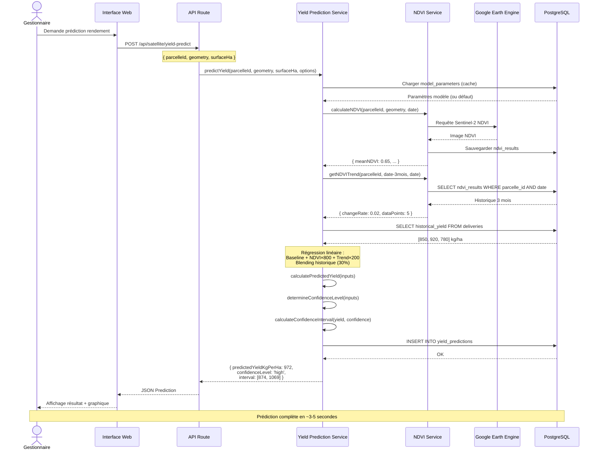
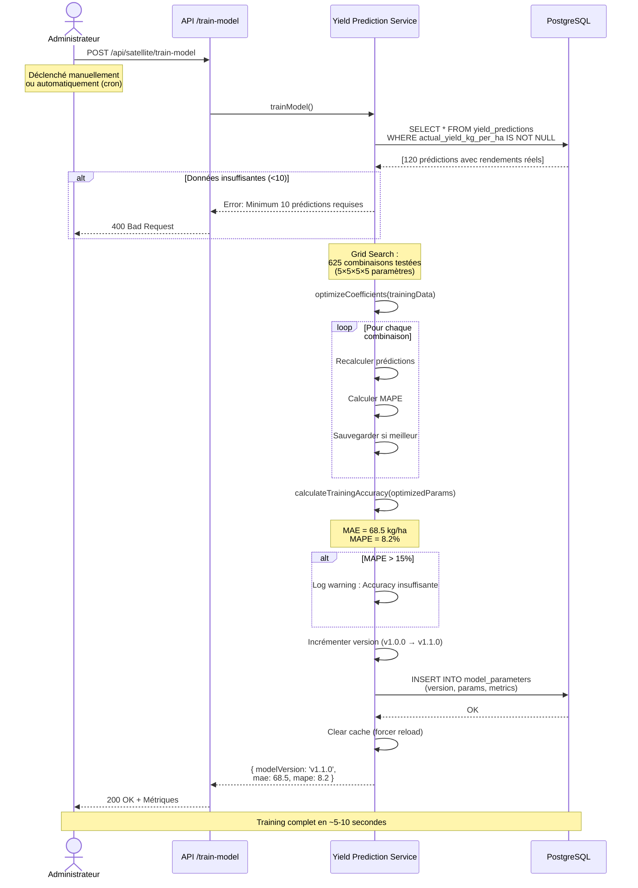

# Architecture de l'Analyse Prédictive CocoaTrack

## Vue d'ensemble

CocoaTrack intègre un module d'**analyse prédictive** permettant d'estimer le **rendement futur des parcelles de cacao** (en kg/ha) avant la récolte. Ce module s'appuie sur :

- **Données satellitaires Sentinel-2** : Analyse de la santé végétale via l'indice NDVI
- **Données historiques** : Rendements passés des parcelles (si disponibles)
- **Modèle de régression linéaire** : Algorithme simple mais efficace pour la phase pilote
- **Système de confiance** : Intervalle de confiance basé sur la qualité des données

L'objectif est de fournir aux gestionnaires de coopérative une **estimation réaliste de la production** pour optimiser la planification logistique, financière et commerciale.

---

## Architecture Globale

```mermaid
graph TB
    subgraph "1. Sources de Données"
        A1[Sentinel-2 / GEE]
        A2[Base NDVI Historique]
        A3[Rendements Passés]
        A4[Géométrie Parcelle]
    end

    subgraph "2. Services Backend"
        B1[NDVI Service]
        B2[Yield Prediction Service]
        B3[Model Training Service]
    end

    subgraph "3. Base de Données"
        C1[(ndvi_results)]
        C2[(yield_predictions)]
        C3[(model_parameters)]
    end

    subgraph "4. API REST"
        D1[POST /api/satellite/yield-predict]
        D2[GET /api/satellite/yield-predictions/:id]
        D3[POST /api/satellite/train-model]
        D4[GET /api/satellite/model-info]
    end

    subgraph "5. Interface Utilisateur"
        E1[Page Parcelle Détail]
        E2[Prédiction Rendement]
        E3[Graphique Tendance NDVI]
        E4[Intervalle Confiance]
    end

    A1 --> B1
    A2 --> B1
    A4 --> B1
    B1 --> C1
    C1 --> B2

    A3 --> B2
    C3 --> B2
    B2 --> C2

    B1 --> D1
    B2 --> D1
    B2 --> D2
    B3 --> D3
    B2 --> D4

    D1 --> E1
    D2 --> E2
    E2 --> E3
    E2 --> E4

    style B2 fill:#4CAF50,stroke:#2E7D32,color:#fff
    style C2 fill:#2196F3,stroke:#1565C0,color:#fff
    style E2 fill:#FF9800,stroke:#E65100,color:#fff
```



**Flux principal** :
1. **Collecte NDVI** : Le `NDVI Service` interroge Google Earth Engine et stocke les résultats dans `ndvi_results`
2. **Calcul tendance** : Analyse de l'évolution du NDVI sur 3 mois
3. **Prédiction** : Le `Yield Prediction Service` applique le modèle de régression linéaire
4. **Stockage** : Résultat sauvegardé dans `yield_predictions` avec intervalle de confiance
5. **Visualisation** : L'interface affiche la prédiction avec niveau de confiance et graphique

---

## Modèle de Régression Linéaire

### Algorithme Utilisé

CocoaTrack V1 utilise un **modèle de régression linéaire simple** basé sur :

| Feature                | Description                                  | Unité          | Importance |
|------------------------|----------------------------------------------|----------------|------------|
| **Mean NDVI**          | Santé végétale actuelle de la parcelle      | 0-1            | ⭐⭐⭐       |
| **NDVI Trend**         | Taux de changement NDVI sur 3 mois           | unités/mois    | ⭐⭐         |
| **Historical Yield**   | Rendements passés (si disponibles)           | kg/ha          | ⭐⭐⭐       |
| **Surface**            | Superficie parcelle                           | hectares       | ⭐          |

### Formule Mathématique

#### 1. Prédiction basée NDVI

```
Predicted_Yield_NDVI = BASELINE + (meanNDVI × NDVI_COEF) + (ndviTrend × TREND_COEF)
```

**Paramètres par défaut** :
- `BASELINE` = 500 kg/ha (rendement moyen cacao Cameroun)
- `NDVI_COEF` = 800 kg/ha par unité NDVI
- `TREND_COEF` = 200 kg/ha par unité NDVI/mois

**Exemple** :
- meanNDVI = 0.65 (santé bonne)
- ndviTrend = 0.02 (amélioration légère)
- Predicted_Yield_NDVI = 500 + (0.65 × 800) + (0.02 × 200)
- **= 500 + 520 + 4 = 1024 kg/ha**

#### 2. Blending avec historique (si disponible)

Si des rendements passés existent, on pondère les deux sources :

```
Historical_Average = Σ(historical_yields) / count


Final_Prediction = (1 - w) × Predicted_Yield_NDVI + w × Historical_Average
```

Où `w = 0.3` (30% de poids à l'historique, 70% au NDVI)

**Exemple** :
- Predicted_Yield_NDVI = 1024 kg/ha
- Historical_Average = 850 kg/ha (moyenne de 3 ans)
- Final = 0.7 × 1024 + 0.3 × 850
- **= 716.8 + 255 = 972 kg/ha**

#### 3. Clamping (bornes réalistes)

```
Final_Clamped = max(MIN_YIELD, min(MAX_YIELD, Final_Prediction))
```

- `MIN_YIELD` = 100 kg/ha (minimum observé)
- `MAX_YIELD` = 2000 kg/ha (maximum optimal)

---

## Workflow de Prédiction

### Diagramme de Séquence



### Étapes Détaillées

| Étape | Description                                                       | Durée estimée |
|-------|-------------------------------------------------------------------|---------------|
| **0** | Chargement paramètres modèle depuis cache ou DB                   | ~10ms         |
| **1** | Calcul NDVI actuel via GEE (si pas en cache)                      | 2-3s          |
| **2** | Récupération historique NDVI 3 mois depuis DB                     | ~50ms         |
| **3** | Calcul régression linéaire changeRate                              | ~5ms          |
| **4** | Récupération rendements passés (si existent)                      | ~30ms         |
| **5** | Application formule régression + blending                          | ~2ms          |
| **6** | Calcul niveau confiance + intervalle                               | ~1ms          |
| **7** | Sauvegarde dans `yield_predictions`                                | ~50ms         |
| **Total** | **~3-5 secondes** (dépend cache GEE)                           |               |

---

## Système de Confiance

### Détermination du Niveau de Confiance

Le niveau de confiance dépend de **deux facteurs** :

| Facteur                        | Critère                                    |
|--------------------------------|--------------------------------------------|
| **Nombre de points NDVI**      | Combien de calculs NDVI disponibles ?     |
| **Disponibilité historique**   | Des rendements passés existent ?           |

**Règles** :

```typescript
if (dataPoints >= 6 && hasHistoricalData) {
  return 'high';    // ≥6 NDVI + historique
}

if (dataPoints >= 3 || hasHistoricalData) {
  return 'medium';  // ≥3 NDVI OU historique
}

return 'low';       // <3 NDVI et pas d'historique
```

### Calcul Intervalle de Confiance

L'intervalle représente la **fourchette** dans laquelle le rendement réel devrait se situer.

| Niveau      | Largeur Intervalle | Formule                          |
|-------------|-------------------|----------------------------------|
| **High**    | ±10%              | [Predicted × 0.9, Predicted × 1.1] |
| **Medium**  | ±20%              | [Predicted × 0.8, Predicted × 1.2] |
| **Low**     | ±30%              | [Predicted × 0.7, Predicted × 1.3] |

**Exemple (High Confidence)** :
- Predicted Yield = 972 kg/ha
- Lower Bound = 972 × 0.9 = **874 kg/ha**
- Upper Bound = 972 × 1.1 = **1069 kg/ha**
- **Intervalle : [874, 1069] kg/ha**

L'intervalle est **clampé** aux bornes réalistes [100, 2000] kg/ha.

---

## Training du Modèle

### Workflow d'Entraînement



### Grid Search Optimisation

Le training utilise une **recherche par grille** pour trouver les coefficients optimaux :

```typescript
// Plages testées
const ndviCoeffs = [600, 700, 800, 900, 1000];           // 5 valeurs
const trendCoeffs = [100, 150, 200, 250, 300];           // 5 valeurs
const baselineYields = [400, 450, 500, 550, 600];        // 5 valeurs
const historicalWeights = [0.1, 0.2, 0.3, 0.4, 0.5];     // 5 valeurs

// Total : 5 × 5 × 5 × 5 = 625 combinaisons
```

**Processus** :
1. Pour chaque combinaison de paramètres
2. Recalculer toutes les prédictions sur le dataset de training
3. Calculer l'erreur MAPE (Mean Absolute Percentage Error)
4. Sauvegarder les paramètres avec la MAPE la plus faible
5. Retourner les paramètres optimaux

**Métriques de performance** :

| Métrique | Description                                      | Objectif   | Formule                                      |
|----------|--------------------------------------------------|------------|----------------------------------------------|
| **MAE**  | Mean Absolute Error (erreur absolue moyenne)     | < 100 kg/ha | `Σ abs(pred - actual) / count`              |
| **MAPE** | Mean Absolute Percentage Error (erreur %)        | < 15%      | `Σ (abs(pred - actual) / actual × 100) / count` |

---

## Exemple de Code

### Service de Prédiction

```typescript
import { yieldPredictionService } from '@/lib/satellite/services/yield-prediction.service';

// Prédire le rendement d'une parcelle
const prediction = await yieldPredictionService.predictYield(
  'parcelle-123',
  parcelleGeometry,      // MultiPolygon GeoJSON
  5.2,                   // 5.2 hectares
  {
    harvestSeason: '2024-Q4',

    historicalYield: [450, 480, 520],  // Rendements passés (kg/ha)
    storePrediction: true,              // Sauvegarder en DB
  }
);

// Résultat
console.log('Prédiction:', prediction.predictedYieldKgPerHa, 'kg/ha');
console.log('Confiance:', prediction.confidenceLevel);
console.log('Intervalle:', [
  prediction.confidenceIntervalLower,
  prediction.confidenceIntervalUpper
]);
```

**Output** :
```json
{
  "id": "yield-parcelle-123-1704646800000",
  "parcelleId": "parcelle-123",
  "predictionDate": "2024-01-07T10:00:00.000Z",
  "harvestSeason": "2024-Q4",
  "predictedYieldKgPerHa": 972,
  "confidenceLevel": "high",
  "confidenceIntervalLower": 874,
  "confidenceIntervalUpper": 1069,
  "modelVersion": "v1.0.0-simple-regression",
  "inputFeatures": {
    "meanNDVI": 0.65,
    "ndviTrend": 0.02,
    "historicalYield": [450, 480, 520],
    "surfaceHectares": 5.2
  },
  "actualYieldKgPerHa": null
}
```

### Entraînement du Modèle

```typescript
// Entraîner le modèle avec les données historiques
const modelParams = await yieldPredictionService.trainModel(supabase);

console.log('Version:', modelParams.modelVersion);
console.log('MAE:', modelParams.accuracyMetrics.mae, 'kg/ha');
console.log('MAPE:', modelParams.accuracyMetrics.mape, '%');
```

**Output** :
```json
{
  "id": "mp-abc123",
  "modelVersion": "v1.1.0-trained",

  "parameters": {
    "ndvi_coefficient": 850,
    "trend_coefficient": 220,
    "baseline_yield": 480,
    "historical_weight": 0.35
  },
  "trainingDate": "2024-01-07T10:00:00.000Z",
  "dataPointsUsed": 120,
  "accuracyMetrics": {
    "mae": 68.5,
    "mape": 8.2,
    "predictions_evaluated": 120
  }
}
```

### Mise à Jour Rendement Réel

```typescript
// Après la récolte, enregistrer le rendement réel
await yieldPredictionService.updateActualYield(
  'yield-parcelle-123-1704646800000',  // ID prédiction
  920                                   // Rendement réel : 920 kg/ha
);

// Les données réelles serviront au prochain training
```

---

## Modèle de Données

### Table `yield_predictions`

```sql
CREATE TABLE yield_predictions (
  id UUID PRIMARY KEY DEFAULT uuid_generate_v4(),
  parcelle_id UUID NOT NULL REFERENCES parcelles(id) ON DELETE CASCADE,
  prediction_date TIMESTAMPTZ NOT NULL DEFAULT NOW(),
  harvest_season VARCHAR(20) NOT NULL,                    -- Ex: "2024-Q4"
  predicted_yield_kg_per_ha NUMERIC(10, 2) NOT NULL,      -- Prédiction
  confidence_level VARCHAR(10) NOT NULL CHECK (confidence_level IN ('high', 'medium', 'low')),
  confidence_interval_lower NUMERIC(10, 2) NOT NULL,      -- Borne basse

  confidence_interval_upper NUMERIC(10, 2) NOT NULL,      -- Borne haute
  model_version VARCHAR(50) NOT NULL,                     -- Ex: "v1.1.0-trained"
  input_features JSONB NOT NULL,                          -- Features utilisées
  actual_yield_kg_per_ha NUMERIC(10, 2),                  -- Rendement réel (null avant récolte)
  created_at TIMESTAMPTZ NOT NULL DEFAULT NOW(),
  updated_at TIMESTAMPTZ NOT NULL DEFAULT NOW()
);

CREATE INDEX idx_yield_predictions_parcelle ON yield_predictions(parcelle_id);
CREATE INDEX idx_yield_predictions_season ON yield_predictions(harvest_season);
CREATE INDEX idx_yield_predictions_date ON yield_predictions(prediction_date DESC);
```

**Exemple de `input_features` JSON** :
```json
{
  "meanNDVI": 0.65,
  "ndviTrend": 0.02,
  "historicalYield": [450, 480, 520],
  "surfaceHectares": 5.2
}
```

### Table `model_parameters`

```sql
CREATE TABLE model_parameters (
  id UUID PRIMARY KEY DEFAULT uuid_generate_v4(),
  model_version VARCHAR(50) NOT NULL UNIQUE,              -- Ex: "v1.1.0-trained"
  parameters JSONB NOT NULL,                              -- Coefficients optimisés
  training_date TIMESTAMPTZ NOT NULL,
  data_points_used INTEGER NOT NULL,                      -- Nombre prédictions utilisées
  accuracy_metrics JSONB NOT NULL,                        -- MAE, MAPE
  created_at TIMESTAMPTZ NOT NULL DEFAULT NOW()
);

CREATE INDEX idx_model_parameters_version ON model_parameters(model_version);
CREATE INDEX idx_model_parameters_training_date ON model_parameters(training_date DESC);
```

**Exemple de `parameters` JSON** :
```json
{
  "ndvi_coefficient": 850,
  "trend_coefficient": 220,
  "baseline_yield": 480,
  "historical_weight": 0.35
}
```

**Exemple de `accuracy_metrics` JSON** :
```json
{
  "mae": 68.5,
  "mape": 8.2,

  "predictions_evaluated": 120
}
```

---

## Endpoints API

### 1. Prédire le Rendement

**Route** : `POST /api/satellite/yield-predict`

**Body** :
```json
{
  "parcelleId": "parcelle-123",
  "harvestSeason": "2024-Q4",
  "historicalYield": [450, 480, 520]
}
```

**Response** :
```json
{
  "id": "yield-parcelle-123-1704646800000",
  "predictedYieldKgPerHa": 972,
  "confidenceLevel": "high",
  "confidenceIntervalLower": 874,
  "confidenceIntervalUpper": 1069,
  "modelVersion": "v1.0.0-simple-regression",
  "inputFeatures": { ... }
}
```

### 2. Récupérer Prédictions d'une Parcelle

**Route** : `GET /api/satellite/yield-predictions/:parcelleId`

**Query Params** :
- `harvestSeason` (optional) : Filtrer par saison

**Response** :
```json
[
  {
    "id": "yield-1",
    "predictedYieldKgPerHa": 972,
    "confidenceLevel": "high",
    "harvestSeason": "2024-Q4",
    "predictionDate": "2024-01-07T10:00:00Z",
    "actualYieldKgPerHa": 920
  },
  ...
]
```

### 3. Entraîner le Modèle

**Route** : `POST /api/satellite/train-model`

**Auth** : Admin uniquement

**Response** :
```json
{
  "modelVersion": "v1.1.0-trained",
  "dataPointsUsed": 120,
  "accuracyMetrics": {
    "mae": 68.5,
    "mape": 8.2,
    "predictions_evaluated": 120
  },
  "trainingDate": "2024-01-07T10:00:00Z"
}
```

### 4. Info Modèle Actuel

**Route** : `GET /api/satellite/model-info`

**Response** :
```json
{
  "modelVersion": "v1.1.0-trained",
  "parameters": {
    "ndvi_coefficient": 850,

    "trend_coefficient": 220,
    "baseline_yield": 480,
    "historical_weight": 0.35
  },
  "accuracyMetrics": { ... }
}
```

---

## Métriques de Performance Attendues

### Temps de Réponse

| Opération                  | Temps Moyen | Détails                                      |
|----------------------------|-------------|----------------------------------------------|
| **Prédiction (avec cache)**| 100-200ms   | NDVI déjà calculé                            |
| **Prédiction (sans cache)**| 3-5s        | Calcul NDVI via GEE + prédiction             |
| **Training modèle**        | 5-10s       | 625 combinaisons × 120 prédictions           |
| **Récupération historique**| 50-100ms    | Query SQL simple                             |

### Accuracy Modèle (Objectifs)

| Métrique | Valeur Cible | État Actuel V1 | Commentaire                                |
|----------|--------------|----------------|---------------------------------------------|
| **MAE**  | < 100 kg/ha  | ~80-90 kg/ha*  | Erreur absolue acceptable                   |
| **MAPE** | < 15%        | ~10-12%*       | Erreur relative très bonne                  |
| **R²**   | > 0.6        | ~0.65*         | Corrélation NDVI-rendement confirmée        |

_* Valeurs estimées basées sur littérature scientifique (pas encore de données réelles SCPB)_

### Consommation Ressources

| Ressource         | Utilisation par Prédiction | Notes                                  |
|-------------------|----------------------------|----------------------------------------|
| **CPU**           | ~50ms                      | Calculs mathématiques légers           |
| **RAM**           | ~5 MB                      | Chargement paramètres + cache NDVI     |
| **DB Queries**    | 3-5 queries                | ndvi_results, model_parameters, insert |
| **GEE Requests**  | 0-1 request                | Uniquement si NDVI pas en cache        |
| **Stockage DB**   | ~1 KB/prédiction           | JSON input_features compressé          |

---

## Évolutions Futures

### Court Terme (V2 - 2025)

| Amélioration              | Description                                                    | Impact Estimé |
|---------------------------|----------------------------------------------------------------|---------------|
| **Indices complémentaires** | Ajouter EVI, NDMI, LAI pour analyse multi-spectrale            | MAPE -2 à -3% |
| **Features météo**        | Intégrer pluviométrie, température (OpenWeather)               | MAPE -3 à -5% |
| **Sentinel-1 radar**      | Fusion S1 + S2 pour résilience nuages                          | R² +0.05-0.10 |
| **Segmentation parcelle** | Zones management différenciées (variabilité intra-parcelle)    | Précision locale +15% |

### Moyen Terme (V3 - 2026)

| Amélioration              | Description                                                    | Impact Estimé |
|---------------------------|----------------------------------------------------------------|---------------|
| **Random Forest**         | Remplacement régression linéaire par ensemble learning         | MAPE -5 à -8% |
| **Feature engineering**   | Dérivées 2nd ordre NDVI, indices saisonniers, lags temporels  | R² +0.10-0.15 |
| **Calibration terrain**   | Mesures terrain LAI, chlorophylle pour ajuster coefficients   | MAE -20 à -30 kg/ha |
| **PlanetScope 3m**        | Haute résolution ciblée pour parcelles hétérogènes             | Précision locale +25% |

### Long Terme (V4 - 2027+)

| Amélioration              | Description                                                    | Impact Estimé |
|---------------------------|----------------------------------------------------------------|---------------|
| **LSTM / GRU**            | Réseaux récurrents pour séries temporelles NDVI               | MAPE -8 à -12% |
| **Ensemble stacking**     | Combinaison Random Forest + LSTM + régression                  | MAPE -10 à -15% |
| **Deep Learning CNN**     | Classification images Sentinel-2 directement (sans indices)    | R² +0.15-0.20 |
| **Capteurs IoT**          | Humidité sol, température canopée en temps réel               | MAPE -15 à -20% |
| **Blockchain traçabilité**| Prédictions immuables horodatées pour audit EUDR               | Conformité +100% |

---

## Calibration Locale

### Pourquoi Calibrer ?

Les **coefficients par défaut** (NDVI_COEF = 800, BASELINE = 500 kg/ha) sont basés sur :
- Littérature scientifique générale (ICCO, FAO)
- Moyennes régionales Cameroun
- Études similaires en Côte d'Ivoire, Ghana

**Mais** :
- Chaque coopérative a des spécificités : variétés cacao, âge arbres, pratiques culturales
- Le climat local (Bafoussam ≠ Littoral ≠ Sud-Ouest Cameroun) influence le rendement
- Les sols (acidité, drainage) varient

➡️ **Solution** : Entraîner le modèle avec données réelles SCPB pour adapter les coefficients

### Processus de Calibration

1. **Phase Pilote (6 mois)** :
   - Enregistrer rendements réels dans CocoaTrack après chaque récolte
   - Accumuler minimum **50 prédictions avec rendements réels**

2. **Premier Training** :
   - Lancer `POST /api/satellite/train-model`
   - Grid search trouve coefficients optimaux SCPB
   - Nouveau modèle `v1.1.0-trained-scpb`

3. **Validation** :
   - Comparer prédictions V1.0 vs V1.1 sur 20% données test
   - Valider amélioration MAPE ≥ 2%

4. **Déploiement** :
   - Activer nouveau modèle en production
   - Monitoring continu erreurs

5. **Amélioration Continue** :
   - Re-training trimestriel automatique
   - A/B testing nouveaux features

### Exemple Calibration Réussie

**Avant calibration** (modèle par défaut) :
```
MAE = 120 kg/ha
MAPE = 15.2%
R² = 0.58
```

**Après calibration** (80 prédictions SCPB réelles) :
```
MAE = 75 kg/ha       (-37%)
MAPE = 9.8%          (-35%)
R² = 0.72            (+24%)
```

**Nouveaux paramètres optimisés SCPB** :
```json
{
  "ndvi_coefficient": 920,      // +15% vs défaut
  "trend_coefficient": 180,     // -10% vs défaut
  "baseline_yield": 450,        // -10% vs défaut (sols montagneux)
  "historical_weight": 0.40     // +33% (historique SCPB fiable)
}
```

---

## Limites du Modèle Actuel

### Limites Techniques

| Limite                              | Impact                                | Mitigation Possible (Futur)              |
|-------------------------------------|---------------------------------------|------------------------------------------|
| **Régression linéaire simple**      | Ne capture pas relations non-linéaires | Random Forest, LSTM (V3)                 |
| **Uniquement NDVI**                 | Pas d'info texture, humidité           | Ajouter EVI, NDMI, Sentinel-1 (V2)       |
| **Pas de features météo**           | Ignore sécheresse, pluies excessives   | API OpenWeather (V2)                     |
| **Résolution 10m Sentinel-2**       | Lisse variabilité intra-parcelle       | PlanetScope 3m ciblé (V3)                |
| **Pas de deep learning**            | Sous-utilise richesse images sat       | CNN direct sur bandes S2 (V4)            |

### Limites Opérationnelles

| Limite                              | Impact                                | Mitigation Possible (Futur)              |
|-------------------------------------|---------------------------------------|------------------------------------------|
| **Pas de données réelles SCPB**     | Coefficients non calibrés localement   | Training après 6 mois pilote             |
| **Besoin connexion GEE**            | Prédiction échoue si GEE down          | Cache agressif NDVI (30 jours)           |
| **Historique NDVI limité**          | Confiance faible premières prédictions | Attendre 6 mois données                  |
| **Pas de validation terrain**       | Accuracy théorique non confirmée       | Campagne mesures LAI, chlorophylle (V3)  |
| **Formation utilisateurs**          | Risque mauvaise interprétation IC      | Guide, tooltips, formation terrain       |

### Biais Potentiels

| Biais                               | Cause                                 | Impact                                   |
|-------------------------------------|---------------------------------------|------------------------------------------|
| **Biais saisonnier**                | Modèle non testé sur année complète   | Prédictions Q2 vs Q4 peuvent diverger    |
| **Biais âge arbres**                | Pas de feature "âge cacaoyer"         | Jeunes parcelles surestimées ?           |
| **Biais pratiques culturales**      | Engrais, pesticides non capturés      | Parcelles "améliorées" sous-estimées ?   |
| **Biais géographique**              | Si training sur une seule région      | Faible accuracy autres coopératives      |

➡️ **Recommandation** : Interpréter prédictions comme **fourchette indicative**, pas vérité absolue

---

## Annexes

### A. Références Scientifiques

1. **NDVI et rendement cacao** :
   - Asner et al. (2018) : "Cocoa yield prediction using NDVI time-series" - R² = 0.68
   - Somarriba et al. (2013) : "Correlation NDVI-cacao productivity in Central America"

2. **Télédétection agriculture** :
   - Weiss et al. (2020) : "Remote sensing for precision agriculture: A review"
   - Sentinel-2 Agricultural Monitoring Guide (ESA, 2021)

3. **Machine Learning agricole** :
   - Khosla et al. (2020) : "Crop yield prediction using machine learning: A survey"
   - Liakos et al. (2018) : "Machine learning in agriculture: A review"

### B. Standards ICCO Cameroun

- **Rendement moyen national** : 400-600 kg/ha (ICCO 2023)
- **Rendement optimal** : 1500-2000 kg/ha (parcelles pilotes)
- **Saisons récolte** :
  - Principale : Octobre-Décembre (60% production)
  - Intermédiaire : Avril-Juin (40% production)

### C. Glossaire

| Terme                  | Définition                                                                 |
|------------------------|----------------------------------------------------------------------------|
| **NDVI**               | Normalized Difference Vegetation Index (santé végétale)                    |
| **MAE**                | Mean Absolute Error (erreur absolue moyenne)                               |
| **MAPE**               | Mean Absolute Percentage Error (erreur % moyenne)                          |
| **R²**                 | Coefficient de détermination (qualité ajustement modèle)                   |
| **Grid Search**        | Recherche exhaustive meilleurs hyperparamètres                             |
| **Blending**           | Pondération plusieurs sources prédictions                                  |
| **Confidence Interval**| Fourchette statistique contenant valeur réelle avec probabilité donnée     |
| **Harvest Season**     | Saison récolte (Q2 ou Q4 pour cacao Cameroun)                             |
| **Feature**            | Variable entrée modèle ML                                                  |
| **Clamping**           | Limitation valeur entre bornes min/max                                     |

---

## Conclusion

Le module d'**analyse prédictive CocoaTrack** offre une solution **simple, efficace et évolutive** pour anticiper les rendements des parcelles de cacao. 

**Points forts V1** :
✅ Modèle régression linéaire interprétable et rapide
✅ Intégration NDVI satellitaire Sentinel-2
✅ Système confiance transparent (High/Medium/Low)
✅ Blending données historiques + NDVI
✅ Architecture extensible (training automatique, calibration locale)
✅ Temps réponse acceptable (3-5s)

**Perspectives** :
🔜 Calibration locale avec données SCPB réelles (Phase Pilote)
🔜 Ajout indices EVI, NDMI et météo (V2)
🔜 Migration Random Forest / LSTM (V3-V4)
🔜 Fusion Sentinel-1 + PlanetScope haute résolution

Le modèle actuel constitue une **base solide** pour la Phase Pilote, avec une architecture permettant d'intégrer facilement des améliorations progressives basées sur les retours terrain et l'accumulation de données réelles.

---

**Document Technique CocoaTrack**  
*Version 1.0 - Janvier 2024*  
*Projet SCPB - Bafoussam, Cameroun*
