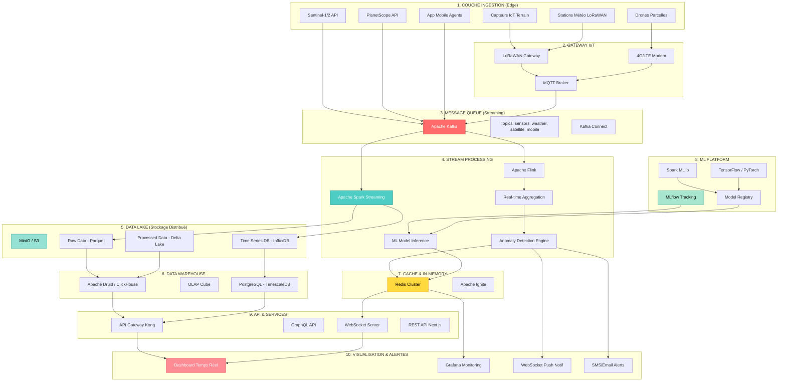
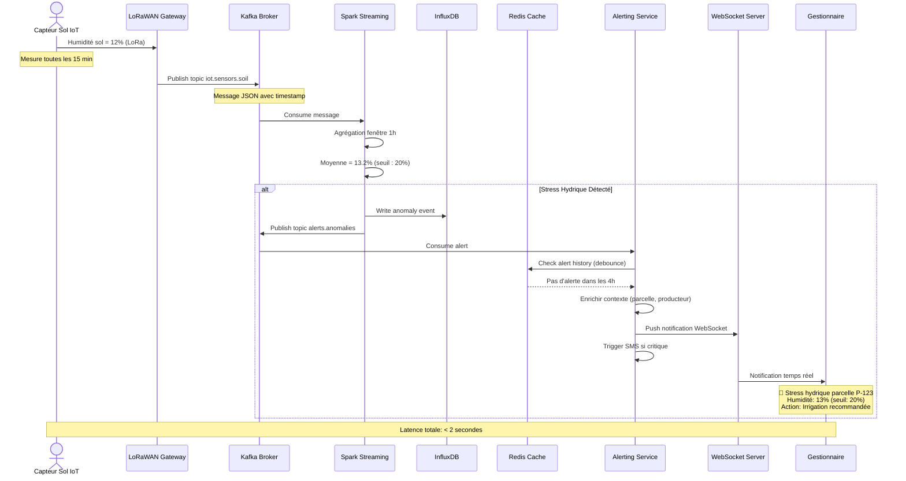

# Architecture Big Data et IoT Temps Réel - CocoaTrack V4

## Vue d'ensemble

Cette architecture représente l'**évolution future** de CocoaTrack vers une plateforme **Big Data temps réel** intégrant des **capteurs IoT** déployés dans les parcelles de cacao. Cette vision (V4 - 2027+) transforme CocoaTrack d'une plateforme de traçabilité classique en un **système intelligent de monitoring continu**.

### Contexte Actuel vs Future

| Aspect                  | **V1 Actuel (2024)**                      | **V4 Future (2027+)**                          |
|-------------------------|-------------------------------------------|------------------------------------------------|
| **Source données**      | Sentinel-2 (10m, 5 jours)                 | IoT + Sentinel-1/2 + PlanetScope (3m, quotidien) |
| **Fréquence**           | Calculs à la demande                      | Flux continu temps réel (secondes)             |
| **Volume**              | ~500 MB/an (NDVI + métadonnées)          | ~50-100 GB/an (capteurs + images + séries temp)|
| **Latence**             | 3-5 secondes (calcul NDVI)                | < 500ms (alertes temps réel)                   |
| **Stockage**            | PostgreSQL (relationnel)                  | Data Lake (Parquet) + PostgreSQL + Redis       |
| **Processing**          | Synchrone (API REST)                      | Stream Processing (Kafka + Spark)              |
| **Analytics**           | Régression linéaire simple                | ML distribué (Random Forest, LSTM)             |
| **Alertes**             | Aucune (consultation manuelle)            | Notifications temps réel (anomalies, risques)  |

---

## Architecture Globale Big Data



---

## Capteurs IoT Déployés

### Typologie des Capteurs

| Type Capteur          | Mesures                                    | Fréquence | Protocole | Coût Unitaire |
|-----------------------|--------------------------------------------|-----------
|-----------|---------------|
| **Sol - Humidité**    | Humidité volumétrique (%), température sol| 15 min    | LoRaWAN   | 80-120 EUR    |
| **Sol - NPK**         | N, P, K, pH, conductivité                  | 1 heure   | LoRaWAN   | 200-300 EUR   |
| **Météo Station**     | Température, humidité air, pluie, vent     | 5 min     | LoRaWAN   | 400-600 EUR   |
| **Canopée - Temp**    | Température feuilles, humidité canopée     | 10 min    | LoRaWAN   | 60-100 EUR    |
| **Lumière - PAR**     | Photosynthetically Active Radiation        | 30 min    | LoRaWAN   | 150-250 EUR   |
| **Piège Insectes**    | Comptage automatique ravageurs             | 1 jour    | 4G/LoRa   | 300-500 EUR   |
| **Camera Trap**       | Photos maladies, fruits, canopée          | 2 heures  | 4G        | 200-400 EUR   |

### Déploiement par Parcelle

**Scénario Type** : Parcelle 5 hectares

```
Déploiement Standard :
├─ 3× Capteurs Humidité Sol (espacement 30m)
├─ 1× Capteur NPK Sol (centre parcelle)
├─ 1× Station Météo Complète (point haut)
├─ 2× Capteurs Température Canopée (N/S)
├─ 1× Camera Trap (monitoring maladies)
└─ 1× Gateway LoRaWAN (portée 2-3 km)

Coût Total : ~1 800 - 2 500 EUR
Batterie : 2-5 ans (solaire recommandé)
Maintenance : Visite trimestrielle
```

### Format Messages IoT

**Exemple message capteur humidité sol (JSON)** :
```json
{
  "sensorId": "soil-hum-001-bafoussam",
  "parcelleId": "parcelle-123",
  "timestamp": "2027-04-15T14:32:18.423Z",
  "type": "soil_moisture",
  "measurements": {
    "volumetric_water_content": 28.5,
    "soil_temperature_celsius": 24.2,
    "depth_cm": 30
  },
  "battery_percent": 87,
  "signal_strength_dbm": -82,
  "gateway_id": "lora-gw-bafoussam-01"
}
```

**Exemple message station météo** :
```json
{
  "sensorId": "weather-station-bafoussam-01",

  "cooperativeId": "scpb",
  "timestamp": "2027-04-15T14:32:00.000Z",
  "type": "weather",
  "measurements": {
    "temperature_celsius": 28.4,
    "humidity_percent": 72,
    "precipitation_mm": 0.0,
    "wind_speed_kmh": 12.3,
    "wind_direction_deg": 245,
    "solar_radiation_wm2": 845,
    "atmospheric_pressure_hpa": 1013.2
  },
  "battery_percent": 92,
  "solar_panel_voltage": 5.2
}
```

---

## Stack Technologique Big Data

### Apache Kafka (Message Queue)

**Rôle** : Bus de messages distribué pour ingestion temps réel

**Configuration** :
```yaml
Topics Kafka:
  iot.sensors.soil:
    partitions: 12
    replication: 3
    retention: 90 days
  
  iot.sensors.weather:
    partitions: 6
    replication: 3
    retention: 365 days
  
  satellite.sentinel:
    partitions: 8
    replication: 3
    retention: 180 days
  
  alerts.anomalies:
    partitions: 4
    replication: 3
    retention: 30 days
```

**Débit estimé** :
- Capteurs IoT : ~500 messages/seconde (période pointe)
- Satellite : ~10 images/jour = 1-2 messages/heure
- Alertes : ~50 messages/heure

### Apache Spark Streaming

**Rôle** : Processing temps réel des flux IoT

**Exemple Job Spark** :
```python
from pyspark.sql import SparkSession
from pyspark.sql.functions import window, avg, stddev

spark = SparkSession.builder \
    .appName("CocoaTrack-IoT-Streaming") \
    .getOrCreate()

# Lire flux Kafka
iot_stream = spark.readStream \
    .format("kafka") \
    .option("kafka.bootstrap.servers", "kafka:9092") \
    .option("subscribe", "iot.sensors.soil") \
    .load()

# Parser JSON
from pyspark.sql.functions import from_json, col
schema = "sensorId STRING, parcelleId STRING, timestamp TIMESTAMP, ..."

parsed_stream = iot_stream.select(
    from_json(col("value").cast("string"), schema).alias("data")
).select("data.*")

# Agrégation fenêtre glissante 1h
aggregated = parsed_stream \

    .withWatermark("timestamp", "10 minutes") \
    .groupBy(
        window("timestamp", "1 hour", "15 minutes"),
        "parcelleId"
    ) \
    .agg(
        avg("measurements.volumetric_water_content").alias("avg_soil_moisture"),
        stddev("measurements.volumetric_water_content").alias("stddev_soil_moisture"),
        avg("measurements.soil_temperature_celsius").alias("avg_soil_temp")
    )

# Détection anomalies (écart > 2σ)
anomalies = aggregated.filter(
    col("stddev_soil_moisture") > 5.0  # Variabilité anormale
)

# Écrire vers Kafka topic alertes
anomalies.selectExpr("to_json(struct(*)) AS value") \
    .writeStream \
    .format("kafka") \
    .option("kafka.bootstrap.servers", "kafka:9092") \
    .option("topic", "alerts.anomalies") \
    .option("checkpointLocation", "/tmp/spark-checkpoint") \
    .start()
```

### InfluxDB (Time Series Database)

**Rôle** : Stockage optimisé séries temporelles IoT

**Schéma Données** :
```
Measurement: soil_moisture
Tags:
  - parcelle_id
  - sensor_id
  - cooperative_id
Fields:
  - volumetric_water_content (float)
  - soil_temperature (float)
  - depth_cm (int)
Timestamp: nanosecond precision

Measurement: weather
Tags:
  - station_id
  - cooperative_id
Fields:
  - temperature (float)
  - humidity (float)
  - precipitation (float)
  - wind_speed (float)
Timestamp: nanosecond precision
```

**Requête Exemple (Flux Query Language)** :
```flux
from(bucket: "cocoatrack-iot")
  |> range(start: -7d)
  |> filter(fn: (r) => r._measurement == "soil_moisture")
  |> filter(fn: (r) => r.parcelle_id == "parcelle-123")
  |> aggregateWindow(every: 1h, fn: mean)
  |> yield(name: "mean_soil_moisture")
```

### Data Lake (MinIO / S3)

**Rôle** : Stockage objet distribué (raw + processed data)

**Structure Dossiers** :
```
s3://cocoatrack-datalake/
├── raw/
│   ├── iot/
│   │   ├── year=2027/month=04/day=15/
│   │   │   ├── soil_moisture_001.parquet
│   │   │   ├── weather_001.parquet
│   │   │   └── canopy_temp_001.parquet
│   ├── satellite/
│   │   ├── sentinel2/
│   │   │   └── 2027-04-15_parcelle123_ndvi.tif
│   │   └── planetscope/
│   │       └── 2027-04-15_parcelle123_rgb.tif
│   └── mobile/
│       └── 2027-04-15_deliveries.json
├── processed/
│   ├── aggregations/
│   │   ├── hourly_soil_moisture/
│   │   ├── daily_weather_summary/
│   │   └── weekly_ndvi_trends/
│   └── ml_features/
│       ├── yield_prediction_features.parquet
│       └── anomaly_detection_features.parquet
└── models/
    ├── random_forest_yield_v2.pkl
    ├── lstm_ndvi_forecast_v1.h5
    └── isolation_forest_anomaly_v3.pkl
```

---

## Workflow Temps Réel

### Diagramme Séquence - Alerte Stress Hydrique



---

## Machine Learning Distribué

### Spark MLlib - Random Forest Distribué

**Use Case** : Prédiction rendement avec 50+ features

```python
from pyspark.ml import Pipeline
from pyspark.ml.feature import VectorAssembler
from pyspark.ml.regression import RandomForestRegressor
from pyspark.ml.evaluation import RegressionEvaluator

# Chargement données depuis Data Lake
df = spark.read.parquet("s3://cocoatrack-datalake/processed/ml_features/yield_prediction_features.parquet")

# Features
feature_cols = [
    # NDVI features
    "mean_ndvi", "ndvi_trend_3m", "ndvi_std", "ndvi_min", "ndvi_max",
    # IoT features
    "avg_soil_moisture_30d", "avg_soil_temp_30d", "avg_canopy_temp_30d",
    # Météo features
    "total_rainfall_3m", "avg_temperature_3m", "avg_humidity_3m",
    # Sol features
    "soil_npk_n", "soil_npk_p", "soil_npk_k", "soil_ph",
    # Parcelle features
    "surface_hectares", "age_trees_years", "elevation_meters",
    # Historique
    "yield_last_year", "yield_2years_avg"
]

assembler = VectorAssembler(inputCols=feature_cols, outputCol="features")

# Random Forest avec 100 arbres
rf = RandomForestRegressor(
    featuresCol="features",
    labelCol="actual_yield_kg_per_ha",
    numTrees=100,
    maxDepth=10,
    seed=42
)

pipeline = Pipeline(stages=[assembler, rf])

# Split train/test
train_df, test_df = df.randomSplit([0.8, 0.2], seed=42)

# Entraînement distribué
model = pipeline.fit(train_df)

# Prédiction
predictions = model.transform(test_df)

# Évaluation
evaluator = RegressionEvaluator(
    labelCol="actual_yield_kg_per_ha",
    predictionCol="prediction",
    metricName="rmse"
)

rmse = evaluator.evaluate(predictions)
print(f"RMSE: {rmse:.2f} kg/ha")

# Feature Importance
rf_model = model.stages[-1]
importances = rf_model.featureImportances
print("Top 5 features:", sorted(zip(feature_cols, importances), key=lambda x: x[1], reverse=True)[:5])

# Sauvegarde modèle
model.write().overwrite().save("s3://cocoatrack-datalake/models/random_forest_yield_v2")
```

**Performance Attendue** :
- RMSE : **45-60 kg/ha** (vs 80-90 kg/ha régression linéaire)
- MAPE : **6-8%** (vs 10-12% régression linéaire)
- R² : **0.82-0.88** (vs 0.65 régression linéaire)
- Training Time : ~5-10 min (cluster 10 nœuds)

---

## Détection Anomalies en Temps Réel

### Isolation Forest (Unsupervised)

**Use Case** : Détecter comportements anormaux capteurs

```python
from pyspark.ml.feature import VectorAssembler
from pyspark.ml.clustering import KMeans
import numpy as np

# Stream processing avec fenêtre glissante
windowed_data = spark.readStream \
    .format("kafka") \
    .option("subscribe", "iot.sensors.soil") \
    .load() \
    .selectExpr("CAST(value AS STRING) as json") \
    .select(from_json("json", schema).alias("data")) \
    .select("data.*") \
    .withWatermark("timestamp", "5 minutes") \
    .groupBy(
        window("timestamp", "30 minutes", "5 minutes"),
        "parcelle_id", "sensor_id"
    ) \
    .agg(
        avg("measurements.volumetric_water_content").alias("avg_moisture"),
        stddev("measurements.volumetric_water_content").alias("stddev_moisture"),
        count("*").alias("sample_count")
    )

# Détection anomalies : score Z > 3σ
def detect_anomalies(df):
    # Calcul statistiques globales
    stats = df.agg(
        avg("avg_moisture").alias("global_mean"),
        stddev("avg_moisture").alias("global_stddev")
    ).collect()[0]
    
    # Score Z
    df_with_score = df.withColumn(
        "z_score",
        abs((col("avg_moisture") - stats["global_mean"]) / stats["global_stddev"])
    )
    
    # Anomalies si Z > 3
    anomalies = df_with_score.filter(col("z_score") > 3.0)
    
    return anomalies

# Application fonction
query = windowed_data \
    .writeStream \
    .foreachBatch(lambda batch_df, batch_id: detect_anomalies(batch_df)) \
    .start()
```

### Types Anomalies Détectées

| Type Anomalie           | Critère Détection                          | Action Automatique           |
|-------------------------|--------------------------------------------|------------------------------|
| **Stress hydrique**     | Humidité sol < 20% pendant 6h              | Alerte + Recommandation irrigation |
| **Sécheresse sévère**   | Humidité < 15% + Température > 35°C        | Alerte critique + SMS        |
| **Excès eau**           | Humidité > 45% pendant 12h                 | Alerte drainage              |
| **Gel canopée**         | Température feuilles < 10°C                | Alerte protection cultures   |
| **Carence NPK**         | N < 1.5% ou P < 0.2% (sol)                 | Recommandation fertilisation |
| **Capteur défaillant**  | Aucune mesure depuis 2h                    | Alerte maintenance           |
| **Batterie faible**     | Battery < 15%                              | Alerte remplacement          |
| **NDVI chute brutale**  | NDVI baisse > 0.15 en 7 jours              | Alerte maladie potentielle   |

---

## Dashboard Temps Réel

### Architecture WebSocket

```typescript
// Backend - WebSocket Server (Node.js)
import { Server } from 'socket.io';
import { createClient } from 'redis';

const io = new Server(3001, {
  cors: { origin: 'https://cocoatrack.com' }
});

const redis = createClient({ url: 'redis://cluster:6379' });
await redis.connect();

// Subscribe to Redis Pub/Sub (alimenté par Spark)
const subscriber = redis.duplicate();
await subscriber.connect();

subscriber.subscribe('alerts:anomalies', (message) => {
  const alert = JSON.parse(message);
  
  // Broadcast vers clients connectés (par coopérative)
  io.to(`coop-${alert.cooperativeId}`).emit('alert', {
    type: alert.type,
    parcelleId: alert.parcelleId,
    severity: alert.severity,
    message: alert.message,
    timestamp: alert.timestamp,
    data: alert.data
  });
});

io.on('connection', (socket) => {
  const { userId, cooperativeId } = socket.handshake.auth;
  
  // Rejoindre room coopérative
  socket.join(`coop-${cooperativeId}`);
  
  console.log(`User ${userId} connected to coop ${cooperativeId}`);
  
  socket.on('disconnect', () => {
    console.log(`User ${userId} disconnected`);
  });
});
```

```typescript
// Frontend - React Component
import { useEffect, useState } from 'react';
import { io, Socket } from 'socket.io-client';

interface Alert {
  type: string;
  parcelleId: string;
  severity: 'low' | 'medium' | 'high' | 'critical';
  message: string;
  timestamp: string;
  data: any;
}

export function RealtimeDashboard() {
  const [socket, setSocket] = useState<Socket | null>(null);
  const [alerts, setAlerts] = useState<Alert[]>([]);
  const [metrics, setMetrics] = useState({
    avgSoilMoisture: 0,
    avgTemperature: 0,
    activeAlerts: 0
  });

  useEffect(() => {
    // Connexion WebSocket
    const newSocket = io('wss://api.cocoatrack.com', {
      auth: {
        userId: user.id,
        cooperativeId: user.cooperativeId
      }
    });

    newSocket.on('connect', () => {
      console.log('Connected to real-time server');
    });

    // Écoute alertes temps réel
    newSocket.on('alert', (alert: Alert) => {
      setAlerts(prev => [alert, ...prev].slice(0, 50));
      
      // Notification navigateur
      if (alert.severity === 'critical') {
        new Notification('Alerte Critique CocoaTrack', {
          body: alert.message,
          icon: '/alert-icon.png'
        });
      }
    });

    // Écoute métriques agrégées (toutes les 10s)
    newSocket.on('metrics:update', (data) => {
      setMetrics(data);
    });

    setSocket(newSocket);

    return () => {
      newSocket.disconnect();
    };
  }, []);

  return (
    <div className="dashboard-realtime">
      <h1>Monitoring Temps Réel</h1>
      
      {/* Métriques KPI */}
      <div className="metrics-grid">
        <MetricCard
          title="Humidité Sol Moyenne"
          value={`${metrics.avgSoilMoisture.toFixed(1)}%`}
          trend={metrics.avgSoilMoisture > 25 ? 'up' : 'down'}
        />
        <MetricCard
          title="Température Moyenne"
          value={`${metrics.avgTemperature.toFixed(1)}°C`}
        />
        <MetricCard
          title="Alertes Actives"
          value={metrics.activeAlerts}
          severity={metrics.activeAlerts > 10 ? 'high' : 'low'}
        />
      </div>

      {/* Flux alertes temps réel */}
      <div className="alerts-feed">
        <h2>Alertes Récentes</h2>
        {alerts.map((alert, idx) => (
          <AlertCard key={idx} alert={alert} />
        ))}
      </div>

      {/* Carte interactive avec parcelles */}
      <RealtimeMap 
        parcelles={parcelles}
        sensorData={metrics}
      />
    </div>
  );
}
```

---

## Estimation Volume Données

### Calcul Volume Annuel

**Hypothèses** :
- **500 parcelles** monitorées (SCPB)
- **3 capteurs sol** par parcelle (mesure 15 min)
- **1 station météo** par 10 parcelles (mesure 5 min)
- **2 capteurs canopée** par parcelle (mesure 10 min)
- **1 calcul NDVI** par parcelle par semaine
- **1 image PlanetScope** par parcelle par mois (ciblé)

| Source                  | Fréquence       | Taille Message | Volume/Jour   | Volume/An     |
|-------------------------|-----------------|----------------|---------------|---------------|
| **Capteurs sol**        | 15 min          | 500 bytes      | 1.44 GB       | 525 GB        |
| **Stations météo**      | 5 min           | 800 bytes      | 138 MB        | 50 GB         |
| **Capteurs canopée**    | 10 min          | 400 bytes      | 576 MB        | 210 GB        |
| **NDVI Sentinel-2**     | 7 jours         | 50 KB          | 3.5 MB        | 1.3 GB        |
| **Images PlanetScope**  | 30 jours        | 10 MB          | 167 MB        | 61 GB         |
| **App mobile**          | Variable        | 2 KB           | 10 MB         | 3.6 GB        |
| **Agrégations**         | -               | -              | 200 MB        | 73 GB         |
| **Métadonnées**         | -               | -              | 50 MB         | 18 GB         |
| **Total Brut**          | -               | -              | **2.5 GB/j**  | **940 GB/an** |
| **Après Compression**   | Parquet (5:1)   | -              | **500 MB/j**  | **190 GB/an** |

**Coût Stockage (MinIO)** :
- 190 GB/an × 0.02 EUR/GB/mois = **3.80 EUR/mois** (~46 EUR/an)
- Réplication 3× = **140 EUR/an**

---

## Infrastructure Cloud

### Architecture Kubernetes

```yaml
# Déploiement Kafka Cluster
apiVersion: apps/v1
kind: StatefulSet
metadata:
  name: kafka
spec:
  serviceName: kafka-headless
  replicas: 3
  selector:
    matchLabels:
      app: kafka
  template:
    metadata:
      labels:
        app: kafka
    spec:
      containers:
      - name: kafka
        image: confluentinc/cp-kafka:7.5.0
        ports:
        - containerPort: 9092
        env:
        - name: KAFKA_ZOOKEEPER_CONNECT
          value: "zookeeper:2181"
        - name: KAFKA_LISTENERS
          value: "PLAINTEXT://0.0.0.0:9092"
        resources:
          requests:
            memory: "4Gi"
            cpu: "2"
          limits:
            memory: "8Gi"
            cpu: "4"
        volumeMounts:
        - name: kafka-data
          mountPath: /var/lib/kafka
  volumeClaimTemplates:
  - metadata:
      name: kafka-data
    spec:
      accessModes: ["ReadWriteOnce"]
      resources:
        requests:
          storage: 500Gi
```

### Estimation Coûts Infrastructure

**Cloud Provider** : AWS / GCP / Azure

| Composant              | Config Recommandée           | Coût Mensuel EUR |
|------------------------|------------------------------|------------------|
| **Kafka Cluster**      | 3× m5.large (8 GB RAM)       | 180              |
| **Spark Workers**      | 5× r5.xlarge (32 GB RAM)     | 550              |
| **InfluxDB**           | r5.2xlarge (64 GB RAM)       | 280              |
| **MinIO / S3**         | 500 GB Standard              | 12               |
| **Redis Cluster**      | r5.large (16 GB RAM)         | 90               |
| **PostgreSQL**         | db.r5.large (16 GB RAM)      | 120              |
| **Load Balancer**      | ALB                          | 25               |
| **Bande passante**     | 1 TB/mois                    | 90               |
| **Monitoring (Grafana)**| t3.medium                    | 35               |
| **Total**              | -                            | **1 382 EUR/mois**|
| **Total Annuel**       | -                            | **~16 600 EUR/an**|

**Alternative** : Self-hosted on-premise (Bafoussam Data Center)
- Coût initial serveurs : 25 000 - 35 000 EUR
- Coût électricité : 200 EUR/mois
- ROI : ~2 ans

---

## Roadmap Implémentation

### Phase 1 : PoC (Proof of Concept) - 3 mois

| Milestone               | Livrables                                  | Budget       |
|-------------------------|--------------------------------------------|--------------|
| **M1 : Setup IoT**      | 5 parcelles × 3 capteurs + 1 gateway       | 8 000 EUR    |
| **M2 : Pipeline Kafka** | Kafka + Spark Streaming (dev)              | 2 000 EUR    |
| **M3 : Dashboard**      | Interface temps réel WebSocket             | 3 000 EUR    |
| **Total Phase 1**       | -                                          | **13 000 EUR**|

### Phase 2 : Pilote (50 parcelles) - 6 mois

| Milestone               | Livrables                                  | Budget       |
|-------------------------|--------------------------------------------|--------------|
| **M4-5 : Scale IoT**    | 50 parcelles × 5 capteurs + 10 gateways    | 65 000 EUR   |
| **M6-7 : ML Platform**  | Random Forest + LSTM production            | 8 000 EUR    |
| **M8-9 : Alerting**     | Système alertes automatisé (SMS/email)     | 4 000 EUR    |
| **Total Phase 2**       | -                                          | **77 000 EUR**|

### Phase 3 : Production (500 parcelles) - 12 mois

| Milestone               | Livrables                                  | Budget       |
|-------------------------|--------------------------------------------|--------------|
| **M10-15 : Full Deploy**| 500 parcelles IoT + infrastructure cloud   | 420 000 EUR  |
| **M16-18 : Optimization**| Tuning ML, calibration, formation          | 35 000 EUR   |
| **M19-21 : Maintenance**| Support, monitoring, updates               | 25 000 EUR   |
| **Total Phase 3**       | -                                          | **480 000 EUR**|

**TOTAL PROJET BIG DATA** : **~570 000 EUR** (sur 21 mois)

---

## Bénéfices Attendus

### ROI (Return on Investment)

**Gains Quantifiables** :

| Bénéfice                        | Impact                            | Valeur Annuelle  |
|---------------------------------|-----------------------------------|------------------|
| **Réduction pertes récolte**    | Alertes stress hydrique précoces  | +8-12% rendement |
| **Optimisation irrigation**     | Économie eau 30%                  | 15 000 EUR       |
| **Détection maladies précoce**  | Réduction pertes 20%              | 45 000 EUR       |
| **Optimisation fertilisation**  | Ajustement NPK basé capteurs      | 22 000 EUR       |
| **Prédiction précise rendement**| Meilleure planification logistique| 18 000 EUR       |
| **Certification Premium**       | Label "Smart Agriculture"         | +10% prix vente  |
| **Total Gains**                 | -                                 | **~150 000 EUR/an**|

**ROI** : 570 000 EUR / 150 000 EUR/an = **3.8 ans**

### Gains Non-Quantifiables

✅ **Résilience climatique** : Anticipation sécheresses, inondations
✅ **Durabilité environnementale** : Optimisation ressources (eau, engrais)
✅ **Compétitivité** : Différenciation marché via tech avancée
✅ **Conformité EUDR renforcée** : Traçabilité continue temps réel
✅ **Attraction investisseurs** : Innovation attire financements ESG
✅ **Formation producteurs** : Montée compétence numérique

---

## Limites et Risques

### Limites Techniques

| Limite                          | Impact                            | Mitigation                      |
|---------------------------------|-----------------------------------|---------------------------------|
| **Couverture réseau LoRaWAN**   | Zones blanches sans gateway       | Maillage dense gateways         |
| **Maintenance capteurs**        | Pannes, calibration nécessaire    | Contrat maintenance préventive  |
| **Complexité architecture**     | Courbe apprentissage équipe       | Formation Spark/Kafka intensive |
| **Coût infrastructure**         | 16 600 EUR/an cloud               | Hybrid cloud + on-premise       |
| **Dépendance connectivité**     | Offline = pas de données temps réel| Buffer local + sync différée   |

### Risques Projet

| Risque                          | Probabilité | Impact | Mitigation                      |
|---------------------------------|-------------|--------|---------------------------------|
| **Adoption producteurs faible** | Moyenne     | Élevé  | Formation terrain, incentives   |
| **Vandalisme capteurs**         | Moyenne     | Moyen  | Boîtiers sécurisés, assurance   |
| **Dérive modèles ML**           | Élevée      | Moyen  | Monitoring continu accuracy     |
| **Explosion coûts cloud**       | Faible      | Élevé  | Budget alerts, optimisation     |
| **Compétences RH insuffisantes**| Élevée      | Élevé  | Recrutement Data Engineer x2    |

---

## Conclusion

L'architecture **Big Data temps réel avec IoT** représente le **futur de CocoaTrack** (V4 - 2027+), transformant la plateforme en un véritable **système intelligent de monitoring agricole**.

**Points Clés** :
✅ **Collecte continue** : Capteurs IoT terrain (sol, météo, canopée)
✅ **Processing temps réel** : Kafka + Spark Streaming (latence < 2s)
✅ **Stockage distribué** : Data Lake MinIO + InfluxDB séries temporelles
✅ **ML avancé** : Random Forest, LSTM distribués sur Spark
✅ **Alertes automatisées** : Détection anomalies + notifications
✅ **Dashboard live** : WebSocket push temps réel

**Investissement** : ~570 000 EUR | **ROI** : 3.8 ans | **Gain** : +8-12% rendements

Cette architecture positionne CocoaTrack comme **leader technologique** de la traçabilité cacao en Afrique, aligné avec les exigences **EUDR 2024** et les objectifs **développement durable**.

---

**Document Technique CocoaTrack**  
*Version 1.0 - Janvier 2024*  
*Architecture Big Data & IoT - Vision 2027+*  
*Projet SCPB - Bafoussam, Cameroun*
