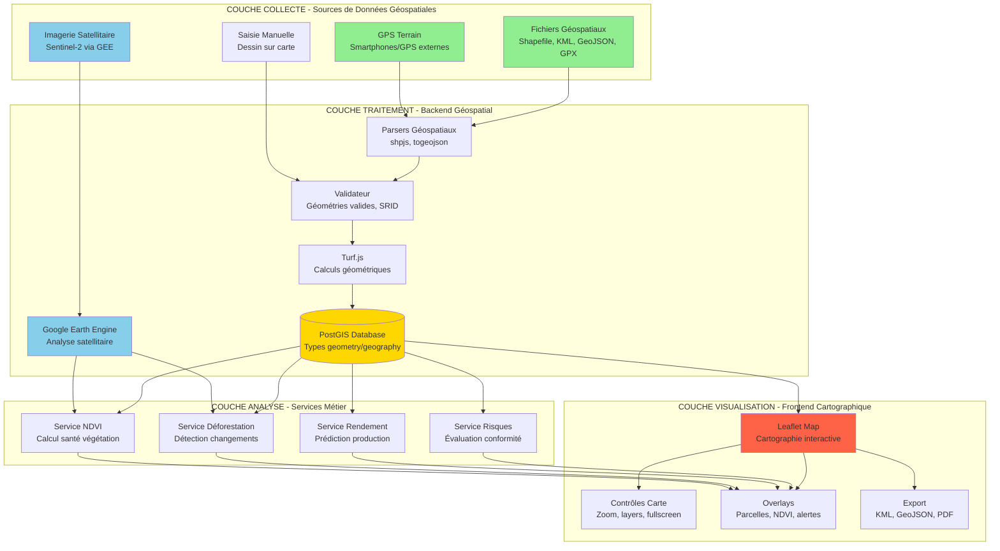
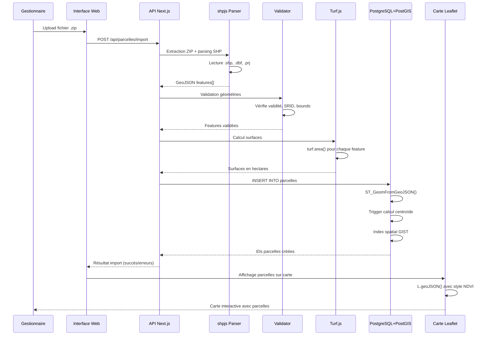
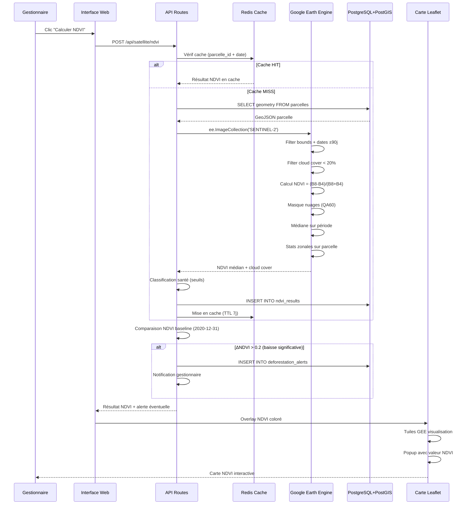
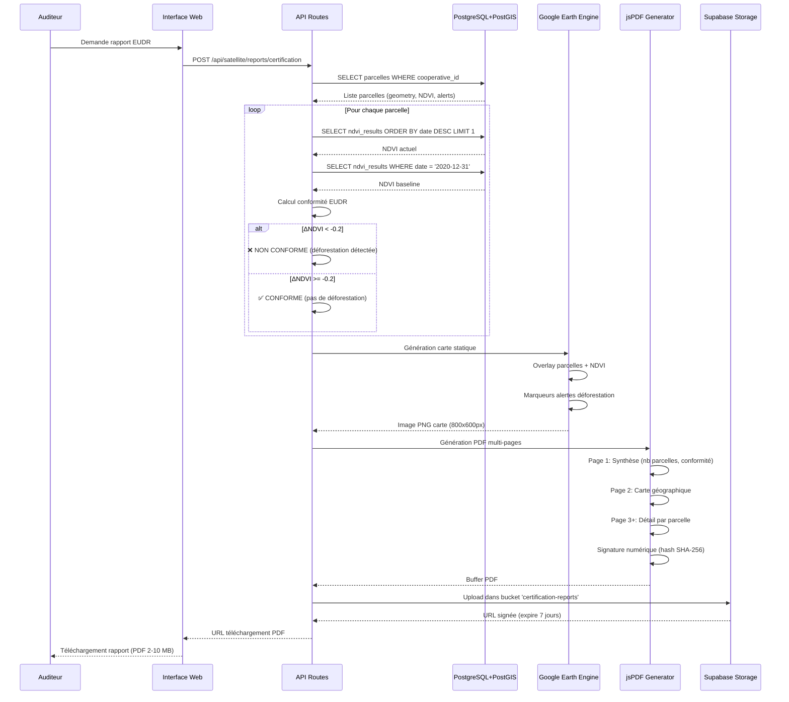

# ARCHITECTURE SIG DE COCOATRACK

**Système d'Information Géographique pour la Traçabilité et le Monitoring Environnemental**

---

## Table des Matières

1. [Vue d'ensemble de l'architecture](#vue-densemble-de-larchitecture)
2. [Composants de l'architecture SIG](#composants-de-larchitecture-sig)
3. [Workflow détaillé](#workflow-détaillé)
4. [Flux de données géospatiales](#flux-de-données-géospatiales)
5. [Technologies et standards SIG](#technologies-et-standards-sig)
6. [Scalabilité et performances](#scalabilité-et-performances)

---

## Vue d'ensemble de l'architecture

L'architecture SIG de CocoaTrack repose sur une approche **cloud-native** combinant des composants open source (PostGIS, Leaflet, Turf.js) et des services cloud managés (Google Earth Engine, Supabase). Elle est conçue selon une architecture en **trois couches** :

1. **Couche de collecte** : Acquisition des données géospatiales (GPS terrain, fichiers, satellites)
2. **Couche de traitement** : Analyse spatiale, calculs géométriques, indexation
3. **Couche de visualisation** : Cartographie interactive, rapports géospatiaux



---

## Composants de l'architecture SIG

### 1. **Couche de Collecte**

#### 1.1 Acquisition GPS Terrain
- **Smartphones** : GPS intégré (précision 5-15m)
- **GPS externes** : Garmin eTrex 20 (précision 3-5m)
- **Format** : Coordonnées WGS84 (EPSG:4326)
- **Stockage** : Colonnes `latitude`, `longitude` (type `DOUBLE PRECISION`)

#### 1.2 Import de Fichiers Géospatiaux
**Formats supportés** :
- **Shapefile** (.zip contenant .shp, .shx, .dbf, .prj)
- **KML/KMZ** (Google Earth)
- **GeoJSON** (format web standard)
- **GPX** (traces GPS)

**Bibliothèques de parsing** :
- `shpjs` : Parsing Shapefile côté client
- `@tmcw/togeojson` : Conversion KML/GPX → GeoJSON
- `jszip` : Décompression archives ZIP

#### 1.3 Imagerie Satellitaire
- **Source** : Sentinel-2 Multi-Spectral Instrument (MSI)
- **Résolution** : 10m (bandes B04, B08), 20m (bandes B05-B12)
- **Fréquence** : 5-10 jours (2 satellites S2A + S2B)
- **Accès** : Google Earth Engine API
- **Période** : Archives depuis juin 2015 (~4000 jours)

#### 1.4 Saisie Manuelle
- **Outil** : Leaflet Draw
- **Actions** : Tracer polygones, modifier géométries, supprimer sommets
- **Snapping** : Accrochage automatique aux sommets existants

---

### 2. **Couche de Traitement**

#### 2.1 Parsing et Validation

**Workflow de parsing** :
```
Fichier uploadé → Détection type MIME → Parser spécifique → GeoJSON normalisé → Validation
```

**Validations appliquées** :
- ✅ Géométrie valide (pas de self-intersection)
- ✅ SRID cohérent (conversion vers EPSG:4326)
- ✅ Type géométrie correct (Polygon/MultiPolygon)
- ✅ Surface > 0 et < 1000 ha (seuil configurable)
- ✅ Coordonnées dans bounds Cameroun (lat: 2-13°N, lon: 8-16°E)

#### 2.2 Calculs Géométriques avec Turf.js

**Opérations côté client** :
```javascript
import * as turf from '@turf/turf';

// Calcul de surface (hectares)
const areaHectares = turf.area(polygon) / 10000;

// Simplification (réduction points pour performance)
const simplified = turf.simplify(polygon, {tolerance: 0.0001});

// Centroïde (point central)
const centroid = turf.centroid(polygon);

// Buffer (zone tampon 100m)
const buffered = turf.buffer(polygon, 100, {units: 'meters'});

// Intersection entre 2 parcelles
const intersection = turf.intersect(polygon1, polygon2);
```

#### 2.3 Stockage PostGIS

**Types géospatiaux utilisés** :
```sql
-- Géométrie des parcelles (MultiPolygon)
geometry(MultiPolygon, 4326)

-- Points GPS (planteurs, livraisons)
geography(Point, 4326)

-- Calcul surface automatique (trigger)
CREATE TRIGGER calculate_surface_hectares
BEFORE INSERT OR UPDATE ON parcelles
FOR EACH ROW
EXECUTE FUNCTION calculate_surface();
```

**Fonctions PostGIS utilisées** :
- `ST_Area(geometry)` : Surface en m²
- `ST_Centroid(geometry)` : Point central
- `ST_Simplify(geometry, tolerance)` : Simplification
- `ST_Intersects(geom1, geom2)` : Test intersection
- `ST_Within(point, polygon)` : Point dans polygone
- `ST_Distance(geog1, geog2)` : Distance en mètres
- `ST_AsGeoJSON(geometry)` : Export GeoJSON
- `ST_GeomFromGeoJSON(json)` : Import GeoJSON

**Indexes spatiaux** :
```sql
-- Index GIST pour requêtes spatiales rapides
CREATE INDEX idx_parcelles_geometry 
ON parcelles USING GIST(geometry);

-- Requêtes accélérées (< 100ms pour 10 000 parcelles)
SELECT * FROM parcelles 
WHERE ST_Intersects(
    geometry, 
    ST_MakeEnvelope(10.5, 5.5, 11.5, 6.5, 4326)
);
```

#### 2.4 Google Earth Engine

**Workflow d'analyse satellitaire** :
```javascript
// 1. Authentification Service Account
ee.Initialize({
  credentials: serviceAccount,
  project: 'ste-scpb'
});

// 2. Chargement collection Sentinel-2
const s2 = ee.ImageCollection('COPERNICUS/S2_SR_HARMONIZED')
  .filterBounds(parcelGeometry)
  .filterDate(startDate, endDate)
  .filter(ee.Filter.lt('CLOUDY_PIXEL_PERCENTAGE', 20));

// 3. Calcul NDVI
const ndvi = s2.map(image => {
  const nir = image.select('B8');  // Proche infrarouge
  const red = image.select('B4');  // Rouge
  return image.addBands(
    nir.subtract(red).divide(nir.add(red)).rename('NDVI')
  );
});

// 4. Statistiques zonales (valeur médiane sur parcelle)
const stats = ndvi.select('NDVI').median().reduceRegion({
  geometry: parcelGeometry,
  reducer: ee.Reducer.median(),
  scale: 10,
  maxPixels: 1e9
});

// 5. Génération image visualisable
const visualization = ndvi.median().visualize({
  bands: ['NDVI'],
  min: 0, max: 1,
  palette: ['brown', 'yellow', 'green', 'darkgreen']
});

// 6. Export URL tuiles cartographiques
const mapId = visualization.getMapId();
return mapId.urlFormat; // https://earthengine.googleapis.com/...
```

---

### 3. **Couche de Visualisation**

#### 3.1 Cartographie Leaflet

**Initialisation de la carte** :
```typescript
const map = L.map('map', {
  center: [5.5, 11.0], // Centre Cameroun
  zoom: 8,
  layers: [baseLayer],
  zoomControl: true,
  attributionControl: true
});

// Fonds de carte
const osm = L.tileLayer('https://{s}.tile.openstreetmap.org/{z}/{x}/{y}.png');
const satellite = L.tileLayer('https://server.arcgisonline.com/...');

const baseLayers = {
  "OpenStreetMap": osm,
  "Satellite": satellite
};

L.control.layers(baseLayers).addTo(map);
```

#### 3.2 Affichage des Parcelles

**GeoJSON Layer** :
```typescript
// Chargement parcelles depuis API
const response = await fetch('/api/parcelles?cooperative_id=123');
const geojson = await response.json();

// Affichage sur carte avec style
L.geoJSON(geojson, {
  style: (feature) => ({
    color: '#FF6347',
    weight: 2,
    fillColor: getNDVIColor(feature.properties.ndvi_current),
    fillOpacity: 0.6
  }),
  onEachFeature: (feature, layer) => {
    // Popup au clic
    layer.bindPopup(`
      <strong>${feature.properties.nom}</strong><br/>
      Surface: ${feature.properties.surface_hectares.toFixed(2)} ha<br/>
      NDVI: ${feature.properties.ndvi_current?.toFixed(3) || 'N/A'}<br/>
      Santé: ${feature.properties.health_status || 'Non analysé'}
    `);
    
    // Zoom au survol
    layer.on('mouseover', () => layer.setStyle({weight: 4}));
    layer.on('mouseout', () => layer.setStyle({weight: 2}));
  }
}).addTo(map);
```

#### 3.3 Overlays NDVI

**Tuiles Earth Engine** :
```typescript
// URL tuiles NDVI depuis GEE
const ndviTileUrl = 'https://earthengine.googleapis.com/v1alpha/projects/...';

// Overlay transparent sur carte
const ndviLayer = L.tileLayer(ndviTileUrl, {
  opacity: 0.7,
  attribution: 'Google Earth Engine - Sentinel-2'
});

// Contrôle d'overlay
const overlays = {
  "Carte NDVI": ndviLayer,
  "Alertes déforestation": deforestationLayer
};

L.control.layers(baseLayers, overlays).addTo(map);
```

#### 3.4 Outils de Dessin

**Leaflet Draw** :
```typescript
const drawnItems = new L.FeatureGroup();
map.addLayer(drawnItems);

const drawControl = new L.Control.Draw({
  edit: {
    featureGroup: drawnItems
  },
  draw: {
    polygon: {
      allowIntersection: false,
      shapeOptions: {
        color: '#FF6347',
        weight: 2
      }
    },
    circle: false,
    circlemarker: false,
    marker: false,
    polyline: false
  }
});

map.addControl(drawControl);

// Événement création polygone
map.on(L.Draw.Event.CREATED, (event) => {
  const layer = event.layer;
  const geojson = layer.toGeoJSON();
  
  // Calcul surface avec Turf.js
  const areaHectares = turf.area(geojson) / 10000;
  
  // Enregistrement en base
  saveParcelle({
    geometry: geojson.geometry,
    surface_hectares: areaHectares
  });
});
```

---

## Workflow Détaillé

### Workflow 1 : Import de Shapefile



**Description du workflow** :

1. **Upload** : Le gestionnaire sélectionne un fichier Shapefile (.zip) contenant 10-100 parcelles
2. **Parsing** : `shpjs` extrait les fichiers (.shp, .shx, .dbf, .prj) et convertit en GeoJSON
3. **Validation** : Vérification géométries valides, SRID EPSG:4326, coordonnées Cameroun
4. **Calculs** : Turf.js calcule surfaces, centroïdes, simplifie géométries si nécessaire
5. **Stockage** : PostgreSQL insère avec type `geometry(MultiPolygon, 4326)`, trigger calcule surface
6. **Indexation** : Index GIST créé automatiquement pour requêtes spatiales rapides
7. **Affichage** : Leaflet charge GeoJSON et affiche avec couleurs selon NDVI

**Temps total** : 5-30 secondes selon nombre de parcelles

---

### Workflow 2 : Calcul NDVI et Détection Déforestation



**Description du workflow** :

1. **Demande** : Gestionnaire clique "Calculer NDVI" sur une parcelle
2. **Cache** : Vérification Redis, si résultat < 7 jours → retour immédiat
3. **Géométrie** : Récupération coordonnées parcelle depuis PostGIS
4. **Filtrage Sentinel-2** : 
   - Bounds : boîte englobante parcelle
   - Dates : ±90 jours autour date demandée
   - Cloud cover : < 20%
5. **Calcul NDVI** : (NIR - Red) / (NIR + Red) avec masque nuages
6. **Statistiques** : Médiane des valeurs NDVI sur pixels de la parcelle
7. **Classification** : 
   - < 0.3 = Très mauvais
   - 0.3-0.4 = Mauvais
   - 0.4-0.55 = Moyen
   - 0.55-0.7 = Bon
   - \> 0.7 = Excellent
8. **Détection déforestation** : 
   - Récupération NDVI baseline (31/12/2020)
   - Si NDVI actuel - NDVI baseline < -0.2 → Alerte
9. **Stockage** : Résultat en base + cache Redis (7 jours)
10. **Visualisation** : Overlay tuiles NDVI colorées sur Leaflet

**Temps total** : 3-15 secondes (selon cache et disponibilité images)

---

### Workflow 3 : Génération Rapport EUDR avec Carte



**Description du workflow** :

1. **Demande** : Auditeur demande rapport EUDR pour toutes parcelles coopérative
2. **Récupération données** : Parcelles + NDVI actuels + NDVI baseline 2020
3. **Évaluation conformité** : 
   - CONFORME si ΔNDVI >= -0.2 (pas de déforestation significative)
   - NON CONFORME si ΔNDVI < -0.2 (déforestation détectée)
4. **Génération carte** : Google Earth Engine crée image statique PNG
5. **Génération PDF** :
   - Page 1 : Statistiques (X parcelles, Y% conformes)
   - Page 2 : Carte avec légende
   - Pages suivantes : Tableau détaillé par parcelle
6. **Signature** : Hash SHA-256 du PDF pour vérification intégrité
7. **Stockage** : Upload Supabase Storage avec URL signée temporaire
8. **Téléchargement** : Auditeur télécharge PDF (valide 7 jours)

**Temps total** : 30-120 secondes selon nombre de parcelles

---

## Flux de Données Géospatiales

### Pipeline de Transformation

```
Données brutes → Normalisation → Validation → Enrichissement → Stockage → Visualisation
```

**Exemple concret : Import KML Google Earth**

```
1. BRUTE : fichier .kml (coordonnées lat/lon, CRS non spécifié)
2. PARSING : @tmcw/togeojson → GeoJSON
3. NORMALISATION : Conversion vers EPSG:4326 explicite
4. VALIDATION : 
   - Géométrie valide (ST_IsValid)
   - Surface > 0,01 ha et < 1000 ha
   - Coordonnées Cameroun (2-13°N, 8-16°E)
5. ENRICHISSEMENT :
   - Calcul surface (Turf.js)
   - Calcul centroïde (PostGIS)
   - Simplification si > 1000 points (tolerance 0.0001°)
6. STOCKAGE : PostgreSQL type geometry(MultiPolygon, 4326)
7. INDEXATION : Index GIST automatique
8. VISUALISATION : Leaflet L.geoJSON() avec style
```

---

## Technologies et Standards SIG

### Standards Respectés

| Standard | Description | Utilisation CocoaTrack |
|----------|-------------|------------------------|
| **WGS84 (EPSG:4326)** | Système coordonnées mondial GPS | Toutes les géométries stockées |
| **GeoJSON (RFC 7946)** | Format d'échange géospatial JSON | API, import/export |
| **WKT (Well-Known Text)** | Représentation textuelle géométries | Export pour SIG externes |
| **Shapefile (ESRI)** | Format fichier SIG standard | Import parcelles |
| **KML (OGC)** | Format Google Earth | Import/export |
| **GPX** | Format traces GPS | Import tracés terrain |

### Bibliothèques Clés

**Backend** :
- `@google/earthengine` : Analyse satellitaire
- PostGIS extension : Types et fonctions spatiales

**Frontend** :
- `leaflet` : Cartographie interactive
- `@turf/turf` : Calculs géométriques JavaScript
- `shpjs` : Parsing Shapefile
- `@tmcw/togeojson` : Conversion KML/GPX

---

## Scalabilité et Performances

### Optimisations Implémentées

**1. Indexes Spatiaux GIST**
```sql
CREATE INDEX idx_parcelles_geometry ON parcelles USING GIST(geometry);
-- Requêtes spatiales : O(log n) au lieu de O(n)
```

**2. Simplification Géométries**
```javascript
// Réduction 5000 points → 500 points (tolérance 0.0001°)
const simplified = turf.simplify(complexPolygon, {tolerance: 0.0001});
```

**3. Cache Redis**
- Résultats NDVI : TTL 7 jours
- Images GEE : TTL 30 jours
- Géométries fréquentes : TTL 24h

**4. Pagination**
```sql
-- Limite 100 parcelles par requête
SELECT * FROM parcelles LIMIT 100 OFFSET 0;
```

**5. Tuiles Vectorielles (Futur)**
- MVT (Mapbox Vector Tiles) pour grandes quantités de parcelles
- Génération côté serveur, rendu côté client

### Limites Actuelles et Solutions

| Limite | Seuil Actuel | Solution Court Terme | Solution Long Terme |
|--------|--------------|----------------------|---------------------|
| **Nombre parcelles** | < 10 000 | Pagination, index GIST | Tuiles vectorielles MVT |
| **Taille fichier Shapefile** | < 50 MB | Compression ZIP | Streaming upload S3 |
| **Résolution NDVI** | 10m (Sentinel-2) | Sentinel-1 fusion | PlanetScope 3m |
| **Latence calcul NDVI** | 5-15s | Cache Redis 7j | Pre-calcul batch nocturne |
| **Stockage images** | 10 GB | Compression PNG | Cloud storage tiering |

---

## Conclusion

L'architecture SIG de CocoaTrack combine des technologies open source robustes (PostGIS, Leaflet, Turf.js) avec des services cloud innovants (Google Earth Engine) pour créer une plateforme de traçabilité géospatiale performante et scalable. L'adoption de standards reconnus (WGS84, GeoJSON, WKT) garantit l'interopérabilité avec les systèmes SIG existants, tandis que l'architecture cloud-native assure la disponibilité et la scalabilité nécessaires au déploiement à grande échelle.

---

**Document créé le** : 30 juin 2026  
**Version** : 1.0  
**Auteur** : Équipe CocoaTrack
