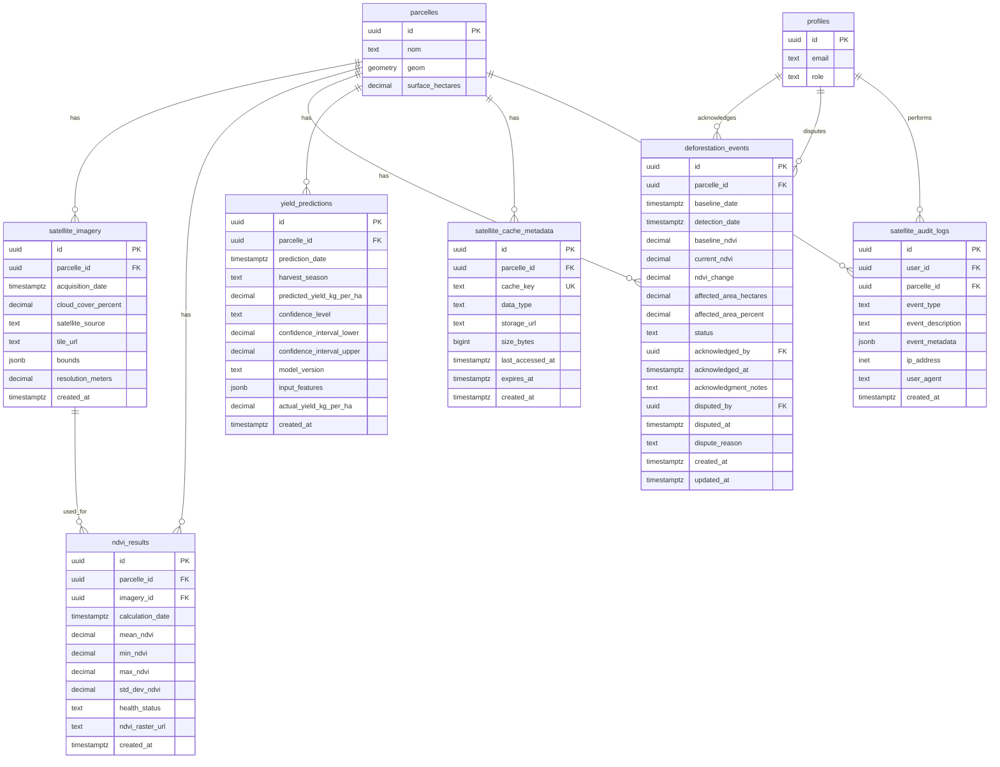

# Database Schema Documentation

## Overview

This document describes the database schema for CocoaTrack, with a focus on the satellite imagery analysis feature. The database uses PostgreSQL with PostGIS extension for geospatial data.

## Satellite Imagery Analysis Tables

The satellite imagery analysis feature introduces six new tables to support NDVI calculation, deforestation detection, yield prediction, and data caching.

### Table of Contents

- [satellite_imagery](#satellite_imagery)
- [ndvi_results](#ndvi_results)
- [deforestation_events](#deforestation_events)
- [yield_predictions](#yield_predictions)
- [satellite_cache_metadata](#satellite_cache_metadata)
- [satellite_audit_logs](#satellite_audit_logs)
- [Entity Relationship Diagram](#entity-relationship-diagram)
- [Relationships and Constraints](#relationships-and-constraints)

---

## satellite_imagery

Stores metadata about satellite imagery retrieved from Google Earth Engine (Sentinel-2).

### Schema

| Column | Type | Constraints | Description |
|--------|------|-------------|-------------|
| `id` | UUID | PRIMARY KEY, DEFAULT uuid_generate_v4() | Primary key |
| `parcelle_id` | UUID | NOT NULL, REFERENCES parcelles(id) ON DELETE CASCADE | Foreign key to parcelles table |
| `acquisition_date` | TIMESTAMPTZ | NOT NULL | Date when satellite captured the imagery |
| `cloud_cover_percent` | DECIMAL(5,2) | NOT NULL, CHECK (0-100) | Percentage of cloud cover in the imagery |
| `satellite_source` | TEXT | NOT NULL, DEFAULT 'sentinel-2' | Source satellite |
| `tile_url` | TEXT | NOT NULL | URL to imagery tiles stored in Supabase Storage |
| `bounds` | JSONB | NOT NULL | GeoJSON bounding box of the imagery |
| `resolution_meters` | DECIMAL(6,2) | NOT NULL | Spatial resolution in meters (typically 10-20m) |
| `created_at` | TIMESTAMPTZ | NOT NULL, DEFAULT NOW() | Timestamp when record was created |

### Constraints

- **UNIQUE**: `(parcelle_id, acquisition_date)` - One imagery record per parcelle per acquisition date

### Indexes

- `idx_satellite_imagery_parcelle` on `parcelle_id`
- `idx_satellite_imagery_date` on `acquisition_date`
- `idx_satellite_imagery_cloud_cover` on `cloud_cover_percent`

### Purpose

This table tracks all satellite imagery retrieved for parcelles, enabling:
- Historical imagery access
- Cloud cover filtering
- Temporal analysis
- Cache management

---

## ndvi_results

Stores calculated NDVI (Normalized Difference Vegetation Index) values and health statistics for parcelles.

### Schema

| Column | Type | Constraints | Description |
|--------|------|-------------|-------------|
| `id` | UUID | PRIMARY KEY, DEFAULT uuid_generate_v4() | Primary key |
| `parcelle_id` | UUID | NOT NULL, REFERENCES parcelles(id) ON DELETE CASCADE | Foreign key to parcelles table |
| `imagery_id` | UUID | REFERENCES satellite_imagery(id) ON DELETE SET NULL | Foreign key to satellite_imagery table |
| `calculation_date` | TIMESTAMPTZ | NOT NULL | Date when NDVI was calculated |
| `mean_ndvi` | DECIMAL(5,4) | NOT NULL, CHECK (-1 to 1) | Mean NDVI value for the parcelle |
| `min_ndvi` | DECIMAL(5,4) | NOT NULL, CHECK (-1 to 1) | Minimum NDVI value |
| `max_ndvi` | DECIMAL(5,4) | NOT NULL, CHECK (-1 to 1) | Maximum NDVI value |
| `std_dev_ndvi` | DECIMAL(5,4) | NOT NULL, CHECK (>= 0) | Standard deviation of NDVI values |
| `health_status` | TEXT | NOT NULL, CHECK (enum) | Health status classification |
| `ndvi_raster_url` | TEXT | NULL | Optional URL to NDVI raster image |
| `created_at` | TIMESTAMPTZ | NOT NULL, DEFAULT NOW() | Timestamp when record was created |

### Health Status Values

- `excellent`: NDVI 0.7-1.0
- `good`: NDVI 0.6-0.7
- `fair`: NDVI 0.5-0.6
- `poor`: NDVI 0.3-0.5
- `critical`: NDVI 0.0-0.3

### Constraints

- **UNIQUE**: `(parcelle_id, calculation_date)` - One NDVI calculation per parcelle per date
- **CHECK**: `health_status IN ('excellent', 'good', 'fair', 'poor', 'critical')`

### Indexes

- `idx_ndvi_results_parcelle` on `parcelle_id`
- `idx_ndvi_results_calculation_date` on `calculation_date`
- `idx_ndvi_results_health_status` on `health_status`
- `idx_ndvi_results_mean_ndvi` on `mean_ndvi`

### Purpose

This table stores NDVI calculations for crop health monitoring, enabling:
- Health status tracking over time
- Temporal trend analysis
- Filtering parcelles by health status
- Agronomist intervention planning

---

## deforestation_events

Stores detected deforestation events for EUDR (EU Deforestation Regulation) compliance monitoring.

### Schema

| Column | Type | Constraints | Description |
|--------|------|-------------|-------------|
| `id` | UUID | PRIMARY KEY, DEFAULT uuid_generate_v4() | Primary key |
| `parcelle_id` | UUID | NOT NULL, REFERENCES parcelles(id) ON DELETE CASCADE | Foreign key to parcelles table |
| `baseline_date` | TIMESTAMPTZ | NOT NULL | EUDR baseline date (typically Dec 31, 2020) |
| `detection_date` | TIMESTAMPTZ | NOT NULL | Date when deforestation was detected |
| `baseline_ndvi` | DECIMAL(5,4) | NOT NULL | NDVI value at baseline date |
| `current_ndvi` | DECIMAL(5,4) | NOT NULL | NDVI value at detection date |
| `ndvi_change` | DECIMAL(5,4) | NOT NULL | NDVI change from baseline (negative = loss) |
| `affected_area_hectares` | DECIMAL(10,4) | NOT NULL | Area affected by deforestation in hectares |
| `affected_area_percent` | DECIMAL(5,2) | NOT NULL | Percentage of parcelle affected |
| `status` | TEXT | NOT NULL, DEFAULT 'pending' | Alert status |
| `acknowledged_by` | UUID | REFERENCES profiles(id) | User who acknowledged the alert |
| `acknowledged_at` | TIMESTAMPTZ | NULL | Timestamp when alert was acknowledged |
| `acknowledgment_notes` | TEXT | NULL | Notes provided when acknowledging |
| `disputed_by` | UUID | REFERENCES profiles(id) | User who disputed the alert |
| `disputed_at` | TIMESTAMPTZ | NULL | Timestamp when alert was disputed |
| `dispute_reason` | TEXT | NULL | Reason provided when disputing |
| `created_at` | TIMESTAMPTZ | NOT NULL, DEFAULT NOW() | Timestamp when record was created |
| `updated_at` | TIMESTAMPTZ | NOT NULL, DEFAULT NOW() | Timestamp when record was last updated |

### Status Values

- `pending`: Alert awaiting review
- `acknowledged`: Alert reviewed and acknowledged
- `disputed`: Alert disputed by user
- `resolved`: Alert resolved

### Constraints

- **CHECK**: `status IN ('pending', 'acknowledged', 'disputed', 'resolved')`

### Indexes

- `idx_deforestation_events_parcelle` on `parcelle_id`
- `idx_deforestation_events_status` on `status`
- `idx_deforestation_events_detection_date` on `detection_date`

### Triggers

- `trigger_update_deforestation_events_updated_at`: Automatically updates `updated_at` on record modification

### Purpose

This table tracks deforestation events for EUDR compliance, enabling:
- Automated deforestation detection
- Alert management workflow
- Compliance reporting
- Audit trail for alert acknowledgments and disputes

---

## yield_predictions

Stores ML-based yield predictions for parcelles with confidence intervals.

### Schema

| Column | Type | Constraints | Description |
|--------|------|-------------|-------------|
| `id` | UUID | PRIMARY KEY, DEFAULT uuid_generate_v4() | Primary key |
| `parcelle_id` | UUID | NOT NULL, REFERENCES parcelles(id) ON DELETE CASCADE | Foreign key to parcelles table |
| `prediction_date` | TIMESTAMPTZ | NOT NULL | Date when prediction was made |
| `harvest_season` | TEXT | NOT NULL | Target harvest season (e.g., "2024-Q4") |
| `predicted_yield_kg_per_ha` | DECIMAL(10,2) | NOT NULL, CHECK (>= 0) | Predicted yield in kg/ha |
| `confidence_level` | TEXT | NOT NULL, CHECK (enum) | Confidence level: high, medium, or low |
| `confidence_interval_lower` | DECIMAL(10,2) | NOT NULL, CHECK (>= 0) | Lower bound of confidence interval |
| `confidence_interval_upper` | DECIMAL(10,2) | NOT NULL, CHECK (>= 0) | Upper bound of confidence interval |
| `model_version` | TEXT | NOT NULL | Version identifier of prediction model |
| `input_features` | JSONB | NOT NULL | Input features used for prediction |
| `actual_yield_kg_per_ha` | DECIMAL(10,2) | CHECK (>= 0) | Actual yield after harvest (nullable) |
| `created_at` | TIMESTAMPTZ | NOT NULL, DEFAULT NOW() | Timestamp when record was created |

### Input Features (JSONB)

The `input_features` column stores a JSON object with:
- `meanNDVI`: Mean NDVI value
- `ndviTrend`: NDVI trend over time
- `historicalYield`: Array of historical yield values
- `surfaceHectares`: Parcelle surface area

### Constraints

- **CHECK**: `confidence_level IN ('high', 'medium', 'low')`
- **CHECK**: `confidence_interval_upper >= confidence_interval_lower`
- **CHECK**: `predicted_yield_kg_per_ha` within confidence interval

### Indexes

- `idx_yield_predictions_parcelle` on `parcelle_id`
- `idx_yield_predictions_harvest_season` on `harvest_season`
- `idx_yield_predictions_prediction_date` on `prediction_date`
- `idx_yield_predictions_input_features` (GIN) on `input_features`

### Purpose

This table stores yield predictions for production planning, enabling:
- Harvest forecasting
- Resource allocation optimization
- Model accuracy tracking (predicted vs actual)
- Historical prediction analysis

---

## satellite_cache_metadata

Tracks cached satellite data for cache management including LRU eviction and expiration.

### Schema

| Column | Type | Constraints | Description |
|--------|------|-------------|-------------|
| `id` | UUID | PRIMARY KEY, DEFAULT uuid_generate_v4() | Primary key |
| `parcelle_id` | UUID | NOT NULL, REFERENCES parcelles(id) ON DELETE CASCADE | Foreign key to parcelles table |
| `cache_key` | TEXT | NOT NULL, UNIQUE | Unique cache key |
| `data_type` | TEXT | NOT NULL, CHECK (enum) | Type of cached data |
| `storage_url` | TEXT | NOT NULL | URL to cached data in Supabase Storage |
| `size_bytes` | BIGINT | NOT NULL, CHECK (> 0) | Size of cached data in bytes |
| `last_accessed_at` | TIMESTAMPTZ | NOT NULL, DEFAULT NOW() | Timestamp of last access (for LRU) |
| `expires_at` | TIMESTAMPTZ | NOT NULL | Expiration timestamp |
| `created_at` | TIMESTAMPTZ | NOT NULL, DEFAULT NOW() | Timestamp when cache entry was created |

### Data Type Values

- `imagery`: Satellite imagery tiles
- `ndvi`: NDVI raster data
- `bands`: Spectral band data

### Constraints

- **UNIQUE**: `cache_key`
- **CHECK**: `data_type IN ('imagery', 'ndvi', 'bands')`

### Indexes

- `idx_satellite_cache_parcelle` on `parcelle_id`
- `idx_satellite_cache_expires` on `expires_at`
- `idx_satellite_cache_last_accessed` on `last_accessed_at`
- `idx_satellite_cache_data_type` on `data_type`

### Purpose

This table manages cached satellite data, enabling:
- LRU (Least Recently Used) cache eviction
- Automatic expiration of stale data
- Storage usage tracking
- Cache hit rate monitoring

---

## satellite_audit_logs

Stores audit logs for satellite imagery analysis operations and user actions.

### Schema

| Column | Type | Constraints | Description |
|--------|------|-------------|-------------|
| `id` | UUID | PRIMARY KEY, DEFAULT uuid_generate_v4() | Primary key |
| `user_id` | UUID | NOT NULL, REFERENCES profiles(id) ON DELETE CASCADE | User who performed the action |
| `parcelle_id` | UUID | REFERENCES parcelles(id) ON DELETE SET NULL | Parcelle involved in the action |
| `event_type` | TEXT | NOT NULL, CHECK (enum) | Type of event |
| `event_description` | TEXT | NOT NULL | Human-readable event description |
| `event_metadata` | JSONB | NULL | Additional event metadata |
| `ip_address` | INET | NULL | IP address of the user |
| `user_agent` | TEXT | NULL | User agent string from request |
| `created_at` | TIMESTAMPTZ | NOT NULL, DEFAULT NOW() | Timestamp when event occurred |

### Event Type Values

- `imagery_retrieved`: Satellite imagery was retrieved
- `ndvi_calculated`: NDVI was calculated
- `deforestation_detected`: Deforestation event was detected
- `deforestation_acknowledged`: Deforestation alert was acknowledged
- `deforestation_disputed`: Deforestation alert was disputed
- `kml_exported`: KML file was exported
- `report_generated`: Certification report was generated
- `cache_accessed`: Cached data was accessed
- `api_request`: API request was made
- `error_occurred`: An error occurred

### Constraints

- **CHECK**: `event_type IN (...)` (see Event Type Values above)

### Indexes

- `idx_satellite_audit_logs_user_id` on `user_id`
- `idx_satellite_audit_logs_parcelle_id` on `parcelle_id`
- `idx_satellite_audit_logs_event_type` on `event_type`
- `idx_satellite_audit_logs_created_at` on `created_at DESC`
- `idx_satellite_audit_logs_user_event_date` (composite) on `(user_id, event_type, created_at DESC)`

### Purpose

This table provides comprehensive audit logging for:
- Security monitoring
- User activity tracking
- Compliance reporting
- Debugging and troubleshooting
- API usage analytics

---

## Entity Relationship Diagram

---

## Relationships and Constraints

### Primary Relationships

1. **parcelles → satellite_imagery** (1:N)
   - One parcelle can have multiple satellite imagery records
   - Cascade delete: Deleting a parcelle removes all associated imagery

2. **parcelles → ndvi_results** (1:N)
   - One parcelle can have multiple NDVI calculations
   - Cascade delete: Deleting a parcelle removes all NDVI results

3. **satellite_imagery → ndvi_results** (1:N)
   - One imagery record can be used for multiple NDVI calculations
   - Set null on delete: Deleting imagery preserves NDVI results

4. **parcelles → deforestation_events** (1:N)
   - One parcelle can have multiple deforestation events
   - Cascade delete: Deleting a parcelle removes all deforestation events

5. **profiles → deforestation_events** (1:N, acknowledged_by)
   - One user can acknowledge multiple deforestation events
   - Nullable: Events can exist without acknowledgment

6. **profiles → deforestation_events** (1:N, disputed_by)
   - One user can dispute multiple deforestation events
   - Nullable: Events can exist without disputes

7. **parcelles → yield_predictions** (1:N)
   - One parcelle can have multiple yield predictions
   - Cascade delete: Deleting a parcelle removes all predictions

8. **parcelles → satellite_cache_metadata** (1:N)
   - One parcelle can have multiple cache entries
   - Cascade delete: Deleting a parcelle removes all cache entries

9. **profiles → satellite_audit_logs** (1:N)
   - One user can generate multiple audit log entries
   - Cascade delete: Deleting a user removes their audit logs

10. **parcelles → satellite_audit_logs** (1:N)
    - One parcelle can be referenced in multiple audit logs
    - Set null on delete: Deleting a parcelle preserves audit logs

### Key Constraints

#### Unique Constraints

- `satellite_imagery`: `(parcelle_id, acquisition_date)` - Prevents duplicate imagery for same date
- `ndvi_results`: `(parcelle_id, calculation_date)` - Prevents duplicate NDVI calculations
- `satellite_cache_metadata`: `cache_key` - Ensures unique cache keys

#### Check Constraints

- `satellite_imagery.cloud_cover_percent`: 0-100 range
- `ndvi_results.mean_ndvi`, `min_ndvi`, `max_ndvi`: -1 to 1 range
- `ndvi_results.std_dev_ndvi`: >= 0
- `ndvi_results.health_status`: Enum validation
- `deforestation_events.status`: Enum validation
- `yield_predictions.confidence_level`: Enum validation
- `yield_predictions`: Confidence interval validation
- `satellite_cache_metadata.data_type`: Enum validation
- `satellite_cache_metadata.size_bytes`: > 0
- `satellite_audit_logs.event_type`: Enum validation

#### Referential Integrity

All foreign key relationships enforce referential integrity with appropriate cascade behaviors:
- **CASCADE**: Child records deleted when parent is deleted (most relationships)
- **SET NULL**: Foreign key set to null when parent is deleted (preserves historical data)

### Data Retention Policies

Based on the design document:

- **satellite_imagery**: 90-day retention for raw imagery tiles
- **ndvi_results**: Indefinite retention for historical analysis
- **deforestation_events**: 7-year retention for EUDR compliance
- **yield_predictions**: Indefinite retention for model improvement
- **satellite_cache_metadata**: 30-day automatic purge of expired entries
- **satellite_audit_logs**: Indefinite retention for audit trail

### Performance Considerations

#### Indexing Strategy

All tables include indexes optimized for common query patterns:
- Foreign key columns for join performance
- Date columns for temporal queries
- Status/enum columns for filtering
- Composite indexes for multi-column queries

#### JSONB Indexes

- `yield_predictions.input_features`: GIN index for JSONB queries
- Enables efficient querying of nested JSON properties

#### Partitioning Recommendations

For large-scale deployments, consider partitioning:
- `satellite_audit_logs` by `created_at` (monthly partitions)
- `ndvi_results` by `calculation_date` (yearly partitions)

---

## Migration Files

The satellite imagery schema is implemented across six migration files:

1. `20260503000001_create_satellite_imagery.sql`
2. `20260503000002_create_ndvi_results.sql`
3. `20260503000003_create_deforestation_events.sql`
4. `20260503000004_create_yield_predictions.sql`
5. `20260503000005_create_satellite_cache_metadata.sql`
6. `20260503000006_create_satellite_audit_logs.sql`

All migrations include:
- Table creation with constraints
- Index creation for performance
- Column comments for documentation
- Appropriate foreign key relationships

---

## Related Documentation

- [Google Earth Engine Setup](../satellite/gee-setup.md)
- [Storage Buckets Configuration](../satellite/storage-buckets.md)
- [API Documentation](../api/satellite.md) (coming soon)
- [NDVI Calculation Guide](../satellite/ndvi-calculation.md) (coming soon)

---

*Last Updated: 2026-05-03*
