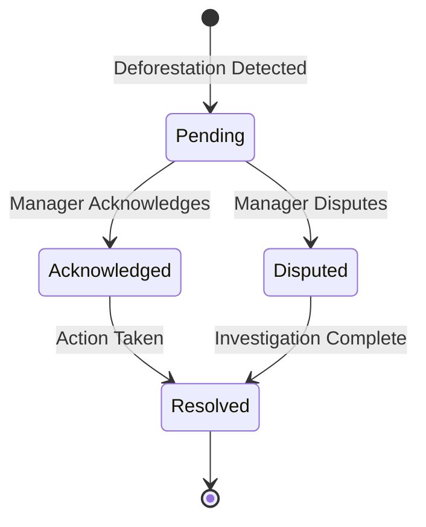

# Deforestation Detection

## Overview

The deforestation detection system uses satellite imagery analysis to identify vegetation loss on cocoa parcelles, supporting EU Deforestation Regulation (EUDR 2024) compliance. The system compares baseline vegetation indices against current measurements to detect significant changes that may indicate deforestation.

## Table of Contents

- [Detection Algorithm](#detection-algorithm)
- [EUDR Compliance Requirements](#eudr-compliance-requirements)
- [Detection Thresholds](#detection-thresholds)
- [Alert Management](#alert-management)
- [API Usage](#api-usage)
- [User Interface](#user-interface)
- [Troubleshooting](#troubleshooting)

## Detection Algorithm

### Overview

The deforestation detection algorithm uses a temporal comparison approach based on NDVI (Normalized Difference Vegetation Index) values. By comparing vegetation health between two time periods, the system can identify areas where significant vegetation loss has occurred.

### Algorithm Steps

1. **Baseline NDVI Calculation**
   - Retrieve satellite imagery from the baseline date (December 31, 2020 for EUDR compliance)
   - If exact date unavailable, use closest cloud-free imagery within 60 days
   - Calculate NDVI using formula: `NDVI = (NIR - Red) / (NIR + Red)`
   - Store baseline NDVI value for the parcelle

2. **Current NDVI Calculation**
   - Retrieve most recent cloud-free satellite imagery
   - Calculate current NDVI using the same formula
   - Ensure cloud cover is below 20% threshold

3. **Change Detection**
   - Calculate NDVI difference: `ΔNDVI = NDVI_baseline - NDVI_current`
   - Calculate affected area in hectares
   - Calculate percentage of parcelle affected

4. **Deforestation Flagging**
   - Flag as deforestation event if ALL conditions are met:
     - ΔNDVI > 0.3 (30% vegetation loss)
     - Affected area > 0.5 hectares
     - Change is persistent (confirmed in subsequent imagery)

5. **Alert Creation**
   - Create deforestation_events record in database
   - Store baseline NDVI, current NDVI, change metrics
   - Set status to 'pending'
   - Trigger notification to cooperative manager and agronomist

### Mathematical Formula

```
NDVI = (NIR - Red) / (NIR + Red)

Where:
- NIR = Sentinel-2 Band 8 (Near-Infrared, 842nm)
- Red = Sentinel-2 Band 4 (Red, 665nm)

ΔNDVI = NDVI_baseline - NDVI_current

Deforestation Detected IF:
  ΔNDVI > 0.3 AND
  Affected_Area > 0.5 hectares AND
  Change_Persistent = true
```

### Persistence Checking

To avoid false positives from temporary changes (e.g., seasonal variations, cloud shadows), the system implements persistence checking:

- **Initial Detection**: Flag potential deforestation when thresholds are met
- **Confirmation Period**: Wait 30 days for next imagery
- **Re-verification**: Recalculate NDVI with new imagery
- **Confirmation**: If ΔNDVI still > 0.3, confirm deforestation event
- **False Positive Handling**: If ΔNDVI returns to normal, mark as false positive

## EUDR Compliance Requirements

### EU Deforestation Regulation 2024

The EU Deforestation Regulation (EUDR) requires that cocoa imported into the European Union must not have been produced on land that was deforested after December 31, 2020.

### Baseline Date

**EUDR Baseline**: December 31, 2020

This date serves as the reference point for all deforestation detection. Any vegetation loss detected after this date may indicate EUDR non-compliance.

### Compliance Verification Process

1. **Baseline Establishment**
   - Retrieve satellite imagery from December 2020
   - Calculate baseline NDVI for each parcelle
   - Store baseline data for future comparisons
   - Handle cases where exact date imagery is unavailable

2. **Ongoing Monitoring**
   - Perform monthly deforestation checks
   - Compare current NDVI against baseline
   - Flag parcelles with significant vegetation loss
   - Generate alerts for investigation

3. **Compliance Reporting**
   - Generate certification reports with before/after imagery
   - Include NDVI comparison data
   - Display compliance status: Compliant, Non-Compliant, Requires Review
   - Provide declaration statement for EUDR compliance

4. **Documentation Requirements**
   - Maintain 7-year retention of deforestation detection results
   - Store baseline imagery and NDVI values
   - Log all alert acknowledgments and disputes
   - Generate audit trail for certification

### Compliance Status Categories

| Status | Description | Action Required |
|--------|-------------|-----------------|
| **Compliant** | No deforestation detected since baseline date | None - maintain monitoring |
| **Non-Compliant** | Deforestation detected exceeding thresholds | Investigation required, may affect certification |
| **Requires Review** | Borderline case or disputed alert | Manual review by certification auditor |
| **Pending Verification** | Initial detection, awaiting confirmation | Wait for persistence check |

## Detection Thresholds

### Primary Thresholds

| Parameter | Threshold | Rationale |
|-----------|-----------|-----------|
| **NDVI Change** | > 0.3 | Indicates significant vegetation loss (30% reduction) |
| **Affected Area** | > 0.5 hectares | EUDR minimum area threshold for deforestation |
| **Cloud Cover** | < 20% | Ensures reliable imagery for analysis |
| **Persistence Period** | 30 days | Confirms change is not temporary |

### NDVI Interpretation

| NDVI Range | Vegetation Status | Interpretation |
|------------|-------------------|----------------|
| 0.8 - 1.0 | Dense vegetation | Healthy forest or mature cocoa |
| 0.6 - 0.8 | Good vegetation | Healthy cocoa plantation |
| 0.4 - 0.6 | Moderate vegetation | Young cocoa or stressed vegetation |
| 0.2 - 0.4 | Sparse vegetation | Degraded land or bare soil with some vegetation |
| 0.0 - 0.2 | Very sparse vegetation | Mostly bare soil or cleared land |
| < 0.0 | Non-vegetation | Water, buildings, or bare rock |

### Change Severity Classification

| ΔNDVI Range | Severity | Description |
|-------------|----------|-------------|
| 0.0 - 0.1 | Minor | Normal seasonal variation |
| 0.1 - 0.2 | Moderate | Possible stress or partial clearing |
| 0.2 - 0.3 | Significant | Substantial vegetation loss |
| > 0.3 | Critical | Likely deforestation event |

### Area Calculation

The affected area is calculated using pixel-level NDVI comparison:

```typescript
// Pseudocode for area calculation
function calculateAffectedArea(
  baselineNDVI: number[][],
  currentNDVI: number[][],
  pixelSize: number // in meters
): number {
  let affectedPixels = 0;
  
  for (let i = 0; i < baselineNDVI.length; i++) {
    for (let j = 0; j < baselineNDVI[i].length; j++) {
      const change = baselineNDVI[i][j] - currentNDVI[i][j];
      if (change > 0.3) {
        affectedPixels++;
      }
    }
  }
  
  // Convert pixels to hectares
  const pixelAreaM2 = pixelSize * pixelSize;
  const affectedAreaM2 = affectedPixels * pixelAreaM2;
  const affectedAreaHa = affectedAreaM2 / 10000;
  
  return affectedAreaHa;
}
```

## Alert Management

### Alert Lifecycle



### Alert Status Definitions

| Status | Description | Who Can Set | Next Actions |
|--------|-------------|-------------|--------------|
| **Pending** | Initial detection, awaiting review | System (automatic) | Review imagery, acknowledge or dispute |
| **Acknowledged** | Manager confirms deforestation occurred | Cooperative Manager, Agronomist | Document cause, take corrective action |
| **Disputed** | Manager disputes the detection | Cooperative Manager, Agronomist | Provide evidence, request manual review |
| **Resolved** | Issue addressed or false positive confirmed | Admin, Auditor | Archive for compliance records |

### Alert Actions

#### Acknowledging an Alert

When a cooperative manager acknowledges a deforestation alert:

1. **Review Alert Details**
   - View before/after imagery
   - Check NDVI comparison data
   - Verify affected area calculation

2. **Provide Context**
   - Add notes explaining the cause (e.g., "Authorized clearing for replanting")
   - Upload supporting documentation if available
   - Specify corrective actions taken

3. **System Actions**
   - Update alert status to 'acknowledged'
   - Record user ID and timestamp
   - Store acknowledgment notes
   - Log action in audit trail
   - Update compliance status

#### Disputing an Alert

When a cooperative manager disputes a deforestation alert:

1. **Provide Reason**
   - Explain why the detection is incorrect
   - Common reasons:
     - Cloud shadow misidentified as deforestation
     - Seasonal vegetation change
     - Imagery date mismatch
     - Incorrect parcelle boundary

2. **Request Review**
   - Alert is flagged for manual review by auditor
   - Auditor examines imagery and evidence
   - Auditor makes final determination

3. **System Actions**
   - Update alert status to 'disputed'
   - Record user ID, timestamp, and reason
   - Notify certification auditor
   - Log action in audit trail

### Notification System

Deforestation alerts trigger notifications to relevant stakeholders:

| Recipient | Notification Trigger | Delivery Method |
|-----------|---------------------|-----------------|
| Cooperative Manager | New alert detected | Email + In-app |
| Assigned Agronomist | New alert detected | Email + In-app |
| Certification Auditor | Alert disputed | Email |
| Admin | High-severity alert (>5 hectares) | Email + SMS |

**Notification Content**:
- Parcelle name and location
- Detection date
- Affected area (hectares and percentage)
- NDVI change value
- Direct link to parcelle detail page
- Recommended actions

## API Usage

### Check for Deforestation

Trigger deforestation detection for a parcelle:

```typescript
POST /api/satellite/deforestation/check

Request:
{
  "parcelleId": "uuid",
  "baselineDate": "2020-12-31", // Optional, defaults to EUDR baseline
  "currentDate": "2024-05-06"   // Optional, defaults to most recent
}

Response:
{
  "newAlerts": [
    {
      "id": "uuid",
      "parcelleId": "uuid",
      "baselineDate": "2020-12-31T00:00:00Z",
      "detectionDate": "2024-05-06T10:30:00Z",
      "baselineNDVI": 0.75,
      "currentNDVI": 0.42,
      "ndviChange": -0.33,
      "affectedAreaHectares": 1.2,
      "affectedAreaPercent": 24.5,
      "status": "pending"
    }
  ],
  "checked": true
}
```

### Get Deforestation Alerts

Retrieve alerts for a parcelle:

```typescript
GET /api/satellite/deforestation?parcelleId=uuid&status=pending

Response:
{
  "alerts": [
    {
      "id": "uuid",
      "parcelleId": "uuid",
      "baselineDate": "2020-12-31T00:00:00Z",
      "detectionDate": "2024-05-06T10:30:00Z",
      "baselineNDVI": 0.75,
      "currentNDVI": 0.42,
      "ndviChange": -0.33,
      "affectedAreaHectares": 1.2,
      "affectedAreaPercent": 24.5,
      "status": "pending",
      "createdAt": "2024-05-06T10:30:00Z"
    }
  ],
  "summary": {
    "totalAlerts": 1,
    "pendingAlerts": 1,
    "affectedAreaTotal": 1.2
  }
}
```

### Acknowledge Alert

Acknowledge a deforestation alert:

```typescript
PATCH /api/satellite/deforestation/:alertId

Request:
{
  "action": "acknowledge",
  "notes": "Authorized clearing for replanting. New cocoa trees planted on May 10, 2024."
}

Response:
{
  "alert": {
    "id": "uuid",
    "status": "acknowledged",
    "acknowledgedBy": "user-uuid",
    "acknowledgedAt": "2024-05-06T14:20:00Z",
    "acknowledgmentNotes": "Authorized clearing for replanting..."
  },
  "updated": true
}
```

### Dispute Alert

Dispute a deforestation alert:

```typescript
PATCH /api/satellite/deforestation/:alertId

Request:
{
  "action": "dispute",
  "reason": "Cloud shadow misidentified as deforestation. Parcelle vegetation is intact."
}

Response:
{
  "alert": {
    "id": "uuid",
    "status": "disputed",
    "disputedBy": "user-uuid",
    "disputedAt": "2024-05-06T14:25:00Z",
    "disputeReason": "Cloud shadow misidentified..."
  },
  "updated": true
}
```

## User Interface

### Deforestation Alert Display

Deforestation alerts are displayed in multiple locations:

#### 1. Parcelle Detail Page

**Alert Banner**:
- Prominent red banner at top of page
- Shows alert severity and affected area
- "View Details" button to expand full information

**Alert Details Panel**:
- Before/after imagery comparison
- NDVI values and change metrics
- Affected area visualization on map
- Timeline of detection
- Action buttons (Acknowledge, Dispute)

#### 2. Parcelle List View

**Alert Indicator**:
- Red warning icon next to parcelle name
- Tooltip showing alert count and total affected area
- Filter option to show only parcelles with alerts

#### 3. Map View

**Visual Indicators**:
- Red outline for parcelles with pending alerts
- Orange outline for acknowledged alerts
- Affected area highlighted in red overlay
- Popup showing alert summary on click

#### 4. Dashboard

**Alert Summary Widget**:
- Total pending alerts count
- Total affected area across all parcelles
- List of most recent alerts
- Quick action buttons

### Before/After Imagery Comparison

The system provides side-by-side comparison of baseline and current imagery:

```
┌─────────────────────────────────────────────────────────┐
│  Baseline (Dec 31, 2020)  │  Current (May 6, 2024)     │
│                            │                             │
│  [Satellite Image]         │  [Satellite Image]         │
│                            │                             │
│  NDVI: 0.75               │  NDVI: 0.42                │
│  Status: Excellent         │  Status: Fair              │
│                            │                             │
│  [NDVI Overlay]           │  [NDVI Overlay]            │
└─────────────────────────────────────────────────────────┘

Change Metrics:
• NDVI Change: -0.33 (44% decrease)
• Affected Area: 1.2 hectares (24.5% of parcelle)
• Detection Date: May 6, 2024
• Status: Pending Review
```

### Mobile View

On mobile devices, the deforestation alert interface is optimized:

- Stacked before/after images (vertical layout)
- Swipe gesture to switch between baseline and current
- Simplified metrics display
- Touch-friendly action buttons
- Collapsible details sections

## Troubleshooting

### Common Issues

#### 1. False Positives

**Symptom**: Alert triggered but no actual deforestation occurred

**Common Causes**:
- Cloud shadows misidentified as vegetation loss
- Seasonal vegetation changes (dry season)
- Imagery date mismatch
- Incorrect parcelle boundary

**Solutions**:
- Dispute the alert with detailed reason
- Request manual review by auditor
- Check imagery dates and cloud cover
- Verify parcelle boundary accuracy
- Wait for persistence check (30 days)

#### 2. Missed Deforestation

**Symptom**: Known deforestation not detected by system

**Common Causes**:
- Cloud cover preventing imagery acquisition
- Deforestation area below 0.5 hectare threshold
- Gradual vegetation loss (ΔNDVI < 0.3)
- Imagery not yet available for recent events

**Solutions**:
- Manually trigger deforestation check
- Use custom baseline date if needed
- Review temporal NDVI trend for gradual changes
- Wait for next imagery acquisition (5-day cycle)
- Report issue to system administrator

#### 3. Baseline Imagery Unavailable

**Symptom**: Cannot establish baseline for EUDR compliance

**Common Causes**:
- High cloud cover in December 2020
- Parcelle created after baseline date
- Imagery archive incomplete for region

**Solutions**:
- System automatically uses closest available imagery within 60 days
- Manual baseline date adjustment (with documentation)
- Use alternative baseline period (Nov 2020 - Jan 2021)
- Contact support for special cases

#### 4. Alert Not Appearing

**Symptom**: Expected alert not showing in interface

**Common Causes**:
- Alert filtered out by status filter
- User lacks permission to view parcelle
- Alert still in persistence check period
- System processing delay

**Solutions**:
- Check filter settings (show all statuses)
- Verify user has access to parcelle
- Wait for persistence check completion
- Refresh page or clear cache
- Check API response for errors

### Error Messages

| Error Code | Message | Solution |
|------------|---------|----------|
| `BASELINE_UNAVAILABLE` | "Baseline imagery not available for this parcelle" | Use alternative baseline date or wait for imagery |
| `INSUFFICIENT_DATA` | "Not enough pixels for reliable detection" | Check parcelle size and imagery resolution |
| `CLOUD_COVER_HIGH` | "Cloud cover too high for accurate detection" | Wait for clearer imagery or use image compositing |
| `GEOMETRY_INVALID` | "Parcelle geometry is invalid" | Update parcelle boundary |
| `RATE_LIMIT_EXCEEDED` | "Too many detection requests" | Wait and retry, or contact admin |

### Performance Optimization

If deforestation detection is slow:

1. **Check API Usage**
   - Monitor Google Earth Engine API quota
   - Review cache hit rate
   - Check for rate limiting

2. **Optimize Imagery Requests**
   - Use cached baseline imagery
   - Reduce cloud cover threshold if needed
   - Batch multiple parcelle checks

3. **Database Performance**
   - Ensure indexes are created
   - Check query execution plans
   - Monitor database connection pool

### Support and Reporting

For issues not covered in this guide:

1. **Check System Status**
   - Visit status page for known issues
   - Check Google Earth Engine service status

2. **Contact Support**
   - Email: support@cocoatrack.com
   - Include: parcelle ID, detection date, error message
   - Attach screenshots if applicable

3. **Report Bugs**
   - Use GitHub issues for technical problems
   - Provide reproduction steps
   - Include system logs if available

## Best Practices

### For Cooperative Managers

1. **Regular Monitoring**
   - Review alerts weekly
   - Investigate pending alerts promptly
   - Document all deforestation causes

2. **Proactive Prevention**
   - Monitor NDVI trends for early warning signs
   - Educate planteurs on EUDR requirements
   - Implement sustainable land management practices

3. **Accurate Record-Keeping**
   - Acknowledge alerts with detailed notes
   - Upload supporting documentation
   - Maintain audit trail for certification

### For Certification Auditors

1. **Verification Process**
   - Review disputed alerts carefully
   - Cross-reference with field visits
   - Validate system detections with manual imagery review

2. **Compliance Assessment**
   - Generate certification reports regularly
   - Verify baseline establishment for all parcelles
   - Document exceptions and special cases

3. **Quality Assurance**
   - Spot-check automated detections
   - Validate NDVI calculations
   - Report systematic issues to development team

### For System Administrators

1. **Monitoring**
   - Track detection accuracy metrics
   - Monitor API usage and rate limits
   - Review error logs regularly

2. **Maintenance**
   - Rotate API keys quarterly
   - Update baseline imagery as needed
   - Optimize cache performance

3. **User Support**
   - Respond to disputed alerts promptly
   - Provide training on system usage
   - Document common issues and solutions

## References

### Scientific Background

- **NDVI**: Tucker, C.J. (1979). "Red and photographic infrared linear combinations for monitoring vegetation." Remote Sensing of Environment.
- **Deforestation Detection**: Hansen, M.C. et al. (2013). "High-Resolution Global Maps of 21st-Century Forest Cover Change." Science.
- **Sentinel-2**: ESA (2015). "Sentinel-2 User Handbook." European Space Agency.

### Regulatory Framework

- **EUDR**: European Commission (2023). "Regulation on deforestation-free products." Official Journal of the European Union.
- **EUDR Baseline**: December 31, 2020 as specified in Article 2 of the regulation.

### Technical Documentation

- [Google Earth Engine Documentation](https://developers.google.com/earth-engine)
- [Sentinel-2 Technical Guide](https://sentinel.esa.int/web/sentinel/technical-guides/sentinel-2-msi)
- [CocoaTrack API Documentation](../api/satellite.md)

## Changelog

| Version | Date | Changes |
|---------|------|---------|
| 1.0.0 | 2024-05-06 | Initial documentation |

---

**Last Updated**: May 6, 2024  
**Document Owner**: CocoaTrack Development Team  
**Review Cycle**: Quarterly
